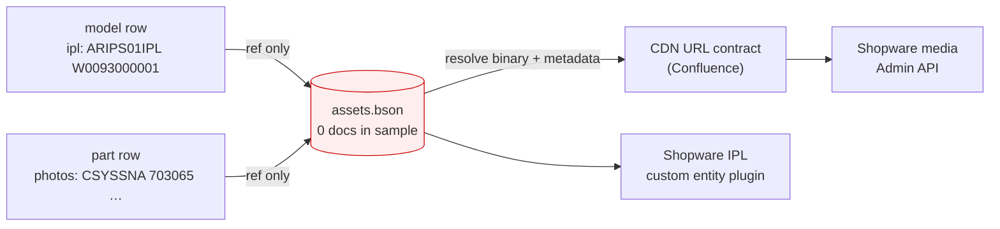
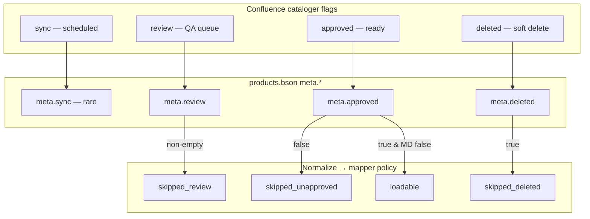
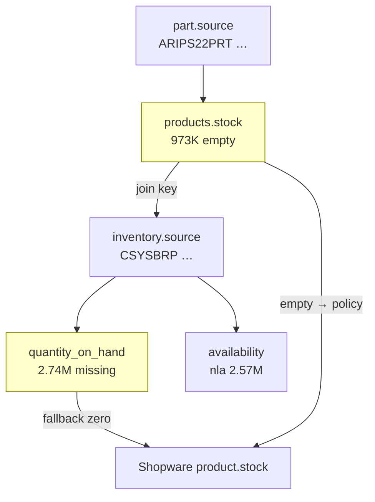
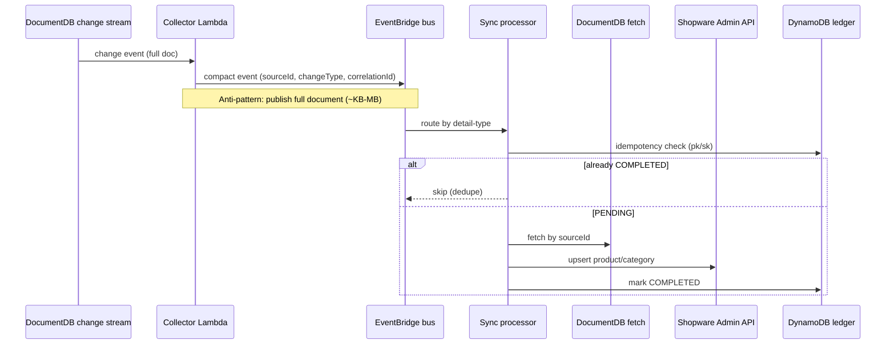

# Schema difficulty diagrams

Client-only evidence (Confluence PDF + BSON sample). Diagrams explain **why** target Shopware schema is hard — not internal consulting gate status.

---

## 1. Current vs target entity model

**Caption:** Source collapses Brand→Model→IPL→Parts into one `products` collection with a `type` discriminator. Target Shopware needs explicit category trees, ~1M IPL categories, and 3.5M part products — every edge must be synthesized in transform code.

```mermaid
flowchart TB
  subgraph Source["Catalog DB (BSON sample)"]
    P[("products.bson<br/>5.14M docs")]
    P -->|type=part| PT[4.76M parts]
    P -->|type=model| MD[383K models]
    MD -->|ipl[] string refs| IPLREF[355K models with IPL refs]
    INV[("inventory.bson<br/>3.63M docs")]
    PT -->|stock field| INV
    ASSETS[("assets.bson<br/>MISSING in sample")]
    IPLREF -.->|no join path| ASSETS
  end

  subgraph Target["Shopware 6 (Confluence MVP)"]
    B[Brand category]
    BF[Brand Family category]
    M[Model category]
    IPL[IPL category / custom entity]
    PR[Part product]
    B --> BF --> M --> IPL --> PR
    ST[Stock on product]
    PR --> ST
  end

  PT -->|normalize + map| PR
  MD -->|UNDECIDED: category vs custom entity| M
  IPLREF -->|blocked without assets| IPL
```

---

## 2. Why IPL / media target is hard

**Caption:** 355K models carry `ipl[]` refs and parts carry `photos[]` asset IDs, but the sample archive has **no** `assets.bson`. IPL plugin + CDN contract cannot be validated from client data alone — diagram shows broken join.



---

## 3. Workflow flag mapping

**Caption:** Confluence describes four cataloger flags; BSON encodes three under `meta.*`. Deleted+approved rows (438,979 products) need explicit publication policy — default skip vs inactive load changes salable counts by ~8.5%.



---

## 4. Stock join complexity

**Caption:** `products.stock` → `inventory.source` is a cross-collection join. 973K parts have empty stock; 2.74M inventory rows lack `quantity_on_hand`. Shopware expects stock on the product — policy defaults mask data gaps.



---

## 5. EventBridge compact event flow (vs full-document anti-pattern)

**Caption:** At 5M+ documents, emitting full BSON on the bus fails size/cost limits. Compact events (sourceId only) match Confluence EventBridge design but force fetch-on-process + idempotent upsert + DynamoDB ledger.



---

## Diagram index

| ID | File section | Used in client matrix |
|----|--------------|----------------------|
| D1 | §1 Entity model | CLI-001–CLI-008 |
| D2 | §2 IPL/media | CLI-009–CLI-014 |
| D3 | §3 Workflow | CLI-015–CLI-019 |
| D4 | §4 Stock | CLI-020–CLI-024 |
| D5 | §5 Events | CLI-025–CLI-028 |
