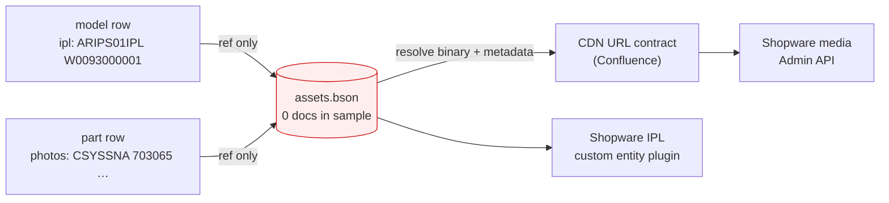
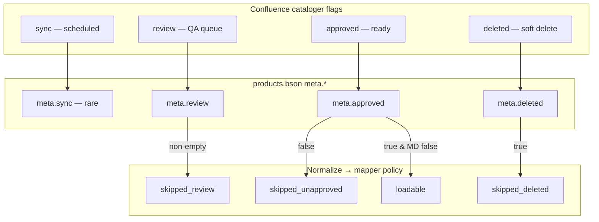
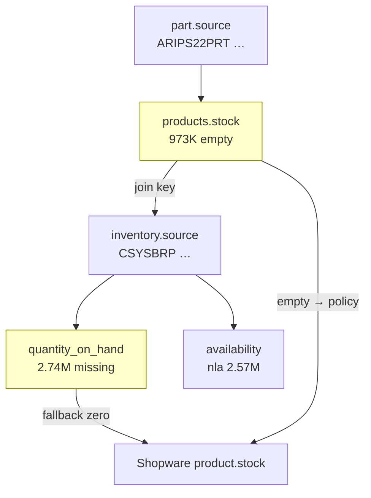
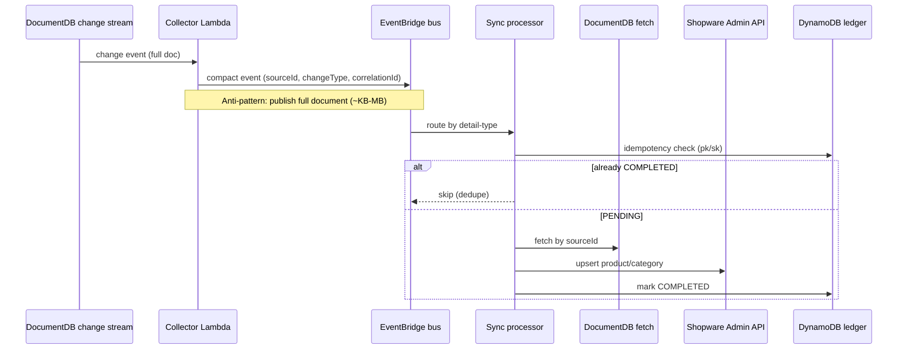

# PartsTree Catalog → Shopware Migration: Post-Mortem Assessment

**Date:** 2026-06-02  
**Classification:** Consulting assessment — client delivery review  
**Evidence basis:** Confluence export (`Confluence-PTREE-010626-130110.pdf`, cited via derived docs where PDF unavailable), BSON sample archive (`input-sample-data.zip`), streaming source profile, migration assessment dry-runs, gate verification artifacts, and agent workstream matrices in this repository.

---

## Disclaimer

This report synthesizes **ideal target state** (Confluence / client overview) against **measured discoveries** from sample BSON, transform pipelines, and consulting gate evidence. It is not a production load authorization, legal finding, or client personnel assessment. Numbers reflect the June 2026 assessment window; full-catalog extrapolations are labeled where derived from sample rates. Issue IDs (`CLI-*`, `IM-*`) reference `client-assessment-issues-matrix` and `assessment-issues-matrix` registers.

---

## Table of Contents

1. [Executive Summary](#executive-summary)
2. [Confluence Target State](#1-confluence-target-state)
3. [Dataset Reality](#2-dataset-reality)
4. [Schema Impedance](#3-schema-impedance)
5. [Transform and Pipeline Failures](#4-transform-and-pipeline-failures)
6. [Process and Governance Failures](#5-process-and-governance-failures)
7. [Issue Catalog and Root Causes](#6-issue-catalog-and-root-causes)
8. [Cloud Agent Fleet Remediation](#7-cloud-agent-fleet-remediation)
9. [Three-Month Recovery Timeline](#8-three-month-recovery-timeline)
10. [Semantic Layer and Self-Service Analysis](#10-semantic-layer-and-self-service-analysis)

---

# Executive Summary

The PartsTree Catalog DB → Shopware 6 migration was scoped in Confluence for roughly three months: baseline ETL via Admin API Sync, a six-level merchandise hierarchy (Brand → Brand Family → Model → Model Variant → IPL → Parts), cataloger workflow gates, CDN-backed media, and compact EventBridge sync for DocumentDB change streams. The program consumed approximately nine months without a production-verified baseline. The gap is not insufficient engineering capacity but inverted sequence—implementation advanced while source shape, mapping contracts, target schema proof, and independent reconciliation stayed open. June 2026 assessment evidence (5,142,183 product documents, 3,626,867 inventory rows, 11,000-row transform dry-run, automated gate verification, 26-role workstream matrix) shows a coherent Confluence target colliding with an unfrozen surface: polymorphic BSON, missing `assets.bson`, seventeen open domain decisions (fifteen without owners), five of twelve gates passing, and twenty-four of twenty-six agents correctly BLOCKED.

Confluence assumed layered collections and frozen Shopware mapping before parallel loader work. The delivered archive is one `products` collection (`type=part|model`: 4,759,440 parts, 382,743 models). Three hundred fifty-five thousand nine hundred thirty-nine models carry `ipl[]` refs without joinable `assets.bson` (eighty-one staging stubs only). Workflow lives under `meta.*`—438,979 soft-deleted products and 26,545 unapproved await OD-06. Nine hundred seventy-three thousand two hundred eighty-seven parts have empty `products.stock` (20.4%); 2,735,879 inventory rows lack `quantity_on_hand` (75.4%); 2,571,968 NLA rows need semantics beyond qty=0. G3 never reached 0/4 artifacts (no OAuth smoke). G4 passed on summary JSON without hash ledgers while transforms achieved only 71.6% payloads (7,879/11,000), 28.4% blocked for contract reasons. Dry-run grouping shows ~4.44M loadable parts and ~3.62M inventory in principle, zero verifiable media/IPL rows locally. The nine-month run paid rework on discoveries a gated Batch A–C would surface in weeks one through four.

Five root causes dominate sixty-eight tracked issues (CLI-001–028, IM-001–040; nearly all preventable).

1. **Architecture preceded measured source (CLI-001, IM-001, IM-016).** Category trees and IPL plugin design ran before BSON profiling revealed a collapsed hierarchy—one collection, 4,784,435 rows with empty `equipment_type` (93.0%), inferred brand family. Client rework estimates exceed thirty-three weeks on hierarchy rows; consulting attribution near five months.

2. **Model→Shopware fork never closed (OD-01).** Option 1 (models as categories) vs Option 2 (custom entity) stayed open through months of transform churn. Dry-run blocks 141,758 of 382,743 models; sample blocked 923/1,000 non-deleted (92.3%). G2 fails on an eleven-row starter CSV without `mapping_approval_record.md`.

3. **Media/IPL without signed assets export (CLI-009–013, IM-002, IM-038).** No `assets.bson` → 2,065/10,000 sample parts `blocked_no_media` (18.8%); media and IPL groups show zero loadable rows. ~520K products reference photos; CDN and IPL plugin unproven.

4. **Gates defined, not enforced (IM-017–019, IM-032, IM-018).** Rules forbid Batch D+ until G0–G4 verified; G0, G2, G3, G5–G8 failed while loaders and EventBridge continued. G4 green on presence alone vs twenty-four BLOCKED agents, zero READY. Fifteen of seventeen decisions unowned; G1 passed on sample while OD-16 (prod freeze) open.

5. **Inventory, publication, sync contracts open while code masked gaps (OD-04–06, IM-010–014, IM-024–026).** `STOCK_FALLBACK=zero` masked 1,054 rows in an 11K sample; 3,670 price parse failures; full-document EventBridge risk at 5M+ scale vs compact ID-only events and DynamoDB ledgers—Batch F ahead of baseline proof.

A **gated cloud agent fleet** compresses time by enforcing that inverse sequence, not by parallelizing loaders. Twenty-six specialized roles map to batches A–F with MCP-backed tooling—BSON profiler, Shopware API smoke, JSON Schema validation, DeepWiki-informed target research, EventBridge simulation—each producing inspectable gate artifacts rather than narrative self-certification. The Lead Orchestrator rejects summary-only child outputs and runs `verify-gates.mjs` before the next batch launches. Week one runs four Batch A discovery agents in parallel (access matrix, checksum manifest, schema snapshot, evidence index with owned decisions). Week two closes OD-01 and publication/stock decisions that slipped to month seven. Batch C classifies every source row into `READY_TO_LOAD`, `REJECTED_WITH_REASON`, or `DEFERRED_WITH_APPROVAL` and emits `payload_hash_ledger.sqlite` plus `dry_run_reconciliation.json` before any Shopware write. Batch D loaders run in dependency order with Independent Reconciliation comparing payload hashes to target read-backs. Correct parallelism is four-wide in discovery and contract weeks, verification-gated dry-run, sequential dev loads—not twenty-six simultaneous “move data” agents.

**Recommended recovery:** twelve-week gated replay per `verification-gates.csv`. Week 0: decision owners, OD-16 boundary. Week 1: Batch A, G0 manifest with explicit assets deferral or restore. Week 2: Option 1/2 decision, G1 profile from real BSON. Weeks 3–4: G2/G3 freeze—approved mapping, schema smoke, assets contract week. Weeks 5–6: Batch C, G4 with deterministic hashes. Weeks 7–9: dev loaders (~4.44M parts, inventory, media/IPL if assets cleared), G5 reconciliation. Week 10: staging (G6). Weeks 11–12: human cutover, prod verification (G7), Batch F sync tests (G8) only after baseline proof.

**Risk without gates** is not merely another three-month slip to nine—it is unbounded rework with false confidence. Loader agents writing millions of rows without G3 target proof will duplicate or mis-key entities at Sync API scale. Treating sample profiling as production freeze will certify loadability that live DocumentDB contradicts. Unresolved OD-01 strands 141,758+ models and blocks IPL navigation regardless of part throughput. Missing assets surface as eighteen-to-twenty percent media blocks on any slice with `photos[]` refs. Superficial G4 passes green-light Batch D until staging reconciliation fails—the months 4–7 pattern: Shopware never OAuth-smoked, 28.4% transform failure budget ignored, 438,979 deleted rows loaded or skipped without OD-06. Parallel “26 agents” without `depends_on` enforcement recreates IM-019 (blocked matrix roles while work continues). Ongoing sync without compact events and ledger idempotency risks DocumentDB 16 MB stream limits, ~256 KB EventBridge ceilings, and duplicate upserts across 5M+ documents. The June 2026 control plane makes these failures visible; leadership must treat verification gates as operational stop conditions, not reporting labels—or pay calendar time again for discoveries a gated twelve-week program prices in week two, while Shopware parity with Confluence remains specified but unproven at production scale.


---

# 1. Confluence Target State

The PartsTree Catalog DB → Shopware migration was specified in Confluence (`Confluence-PTREE-010626-130110.pdf`, cited here as the architecture export) and elaborated in the client overview `partstree_catalog_shopware_overview.md`. Together they define a **target state**, not a description of what the BSON sample contains. The export positions Catalog DB (Mongo-compatible DocumentDB in AWS VPC) as the authoritative source of truth and Shopware 6 as the commerce, search, navigation, and partially headless content layer. Synchronization is continuous: baseline ETL loads the full catalog once; ongoing change streams keep Shopware aligned with cataloger edits, stock updates, and media refreshes. This section reconstructs that intended architecture—the hierarchy, Shopware constructs, workflow gates, sync topology, and MVP boundaries—as the baseline against which migration success was supposed to be measured.

## Catalog hierarchy and navigation intent

Confluence describes a six-level merchandise tree that governs both storefront navigation and loader dependency order:

```text
Brand → Brand Family → Model → Model Variant → IPL (illustrated parts list) → Parts
```

Each level carries distinct semantics. **Brand** (e.g., Echo, Cub Cadet, Gravely) maps to top-level Shopware categories and often to manufacturers; brands are stable, ingestion-created, and rarely deleted. **Brand Family** (e.g., Echo Chainsaws, Exmark Navigator) sits under brand and groups equipment by type for SEO and landing-page navigation; Confluence treats it as a first-class category even when the source DB infers it from model metadata rather than storing a dedicated entity. **Model** represents a specific equipment line; commerce planning assumed on the order of **~300,000** model records, though measured BSON later showed **382,743** `type=model` rows—a scale delta the target must still accommodate. **Model Variant** captures sub-configurations within a model where the catalog differentiates them. **IPL** is the illustrated parts diagram—the interactive schematic linking hotspot coordinates to part SKUs—not a sellable product. **Parts** are the **4.4M+** sellable SKUs (Confluence and Sync API planning cite **~4.4 million** part products plus **~241,000** category nodes once models and IPL navigation layers are materialized).

The hierarchy is not decorative. It drives URL structure, Store API associations, category indexing, and the phased loader sequence: manufacturers and tax foundations first, then category tree, then IPL custom entities, then part products, then media associations, then inventory deltas. Confluence explicitly rejects treating the CDN as a parallel product catalog; media URLs flow through Shopware custom fields and media entities while reusing the existing PartsTree CDN (CloudFront over S3, with origin access control per AWS guidance referenced in the target systems index).

## Shopware 6 MVP: categories, custom entities, and custom fields

The Confluence MVP centers on **Shopware 6 Admin API** bulk writes via `POST /api/_action/sync`, with indexing deferred through `indexing-behavior: use-queue-indexing` during migration-scale loads. Target-side identity is deterministic: stable 32-character hex UUIDs derived from source keys (`products.source`, `inventory.source`) so retries at millions of rows do not create duplicates.

**Categories** carry navigational hierarchy—brand, brand family, model, and potentially model variant and IPL category nodes depending on the unresolved model-mapping decision (see below). Categories expose native SEO paths and Store API category trees; scalar PartsTree metadata that does not warrant relational structure lives in **custom fields** on category, product, and related entities. Confluence specifies the **`custom_` prefix** convention (documented around pages 61–65 of the export); the assessment schema bundle names representative fields such as `custom_part_source_id`, `custom_part_pt_stock_id`, `custom_part_availability_code` (enum `ava`, `nla`, `obs`), `custom_images_cdn_url`, `custom_model_source_id`, `custom_ipl_source_id`, `custom_equipment_type`, and `custom_meta_review`. Parity of **30+ custom fields** across dev, staging, and prod is a G3 gate requirement; the IPL plugin adds entity-specific fields beyond this bundle.

**IPL diagrams** are not modeled as categories alone or as JSON blobs on products at scale. Confluence mandates the **`PartsTreeIplPlugin`**: a **custom entity `ipl`** with join tables (`ipl_model`, `ipl_product`) for many-to-many associations between diagrams, models, and part products. Hotspots, SVG/raster references, and diagram metadata belong on the custom entity; **355,939** source models carry `ipl[]` string refs in BSON, implying hundreds of thousands of IPL associations once assets are joinable. The plugin must remain upgrade-safe per Shopware extension guidelines—custom entities and joins, not ad-hoc product extensions that break platform upgrades.

**Parts** map to standard Shopware `product` entities with `productNumber` equal to source SKU, stock on `product.stock` (or Multi-Inventory API if warehouse groups are adopted), visibility and `active` flags driven by workflow policy, and custom fields for scalar catalog attributes. Stock joins source `products.stock` → `inventory.source`; Confluence acknowledges brand-name variant sharing of inventory rows, so the target expects explicit join logic rather than assuming one SKU per stock document.

The recommended hybrid from DeepWiki assessment (aligned with Confluence intent) reads:

```text
Category tree (brand → family → model [→ variant])
  ↔ custom field source IDs
Custom entity ipl (PartsTreeIplPlugin)
  ↔ ipl_model ↔ model refs
  ↔ ipl_product ↔ part products
Product (part) + custom_fields + Shopware media + CDN URL custom field
```

## Option 1 vs Option 2: the unresolved model fork

Confluence left **Models→IPLs** as an open architectural fork—recorded in the program as open decision **OD-01** and blocking **141,758** model rows in dry-run until resolved:

- **Option 1 — models as categories:** Model records become Shopware category nodes under brand family, with IPLs represented as child categories and/or linked via the IPL custom entity plugin. This path maximizes native category navigation and SEO but pushes category volume toward **~241,000 loadable models** plus IPL category layers—stressing Sync API batch sizing and indexer queues.

- **Option 2 — models as custom entities (or alternate graph):** Models depart from the pure category tree, using custom entities and join tables for model↔IPL relationships while categories handle brand/family navigation only. This reduces category cardinality but requires custom entity Store API exposure and more plugin surface area.

Until the domain owner chooses Option 1 or Option 2, Confluence's own dependency graph blocks Phase 2 (category tree) and cascades into IPL and part association loaders. Assessment measured **923 of 1,000** sample models blocked (**92.3%**) when mapping remained undecided—demonstrating that the target state was specified but not **frozen**, a distinction this report treats as a governance failure rather than a technical surprise.

## Media and CDN contract

Confluence specifies reuse of the existing PartsTree CDN rather than building a shadow media system. The contract chain is: **`assets` collection** in Catalog DB → resolve binary and metadata → construct public CDN URL → Shopware **`media`** entity + **`product_media`** association, with **`custom_images_cdn_url`** (or equivalent) retaining the canonical external URL per Shopware media-path ADR guidance. IPL diagram assets follow the same path into the IPL custom entity. S3 holds object storage; CloudFront with origin access control serves public URLs. **`CDN_BASE_URL`** is a required environment variable in the access matrix; without it, transforms cannot resolve photo refs on the **~520,000** products with non-empty `photos[]` observed in BSON profiling.

The target does **not** authorize loading parts with unresolved media when policy requires assets join—Confluence treats media as part of the sellable catalog surface, not an optional post-load cosmetic step.

## Cataloger workflow: sync, review, approved, deleted

Cataloger operations in the source system use four workflow flags that Confluence maps directly to ETL and sync gating:

| Flag | Confluence meaning | Target behavior |
|------|-------------------|-----------------|
| **sync** | Scheduled for synchronization | Row eligible for downstream pickup |
| **review** | In QA queue | Hold from storefront until cleared |
| **approved** | Ready for website/API consumers | May load to Shopware as active/salable per policy |
| **deleted** | Soft delete | Must not appear as salable; explicit skip or `active: false` |

The **CRON ETL** path (batch baseline load) checks **approved** and **deleted** (among other flags) before invoking the website API—only publication-ready rows reach Shopware. The **continuous EventBridge sync** design inherits the same gating: compact-event processors must apply identical publication rules when fetching authoritative state from DocumentDB and normalizing to Shopware payloads. Allowing the event processor to bypass CRON checks would violate the cataloger's approval contract and risk loading **438,979** soft-deleted or **26,545** unapproved products if BSON `meta.*` fields are mapped incorrectly.

Confluence documents top-level flag names; measured source data often nests equivalents under `meta.approved`, `meta.deleted`, and `meta.review`, with top-level `sync` rarely populated. The **target contract** is semantic (approved/deleted/review/sync behavior), not positional field names—the normalization layer must map `meta.*` explicitly while preserving Confluence gating intent in both CRON and event paths.

## Baseline ETL vs ongoing sync (Phase 7)

Confluence distinguishes two modes that share normalization code:

**Baseline load (Batch D–E):** Dependency-ordered loaders write manufacturers, categories, IPL entities, products, media, and inventory through Admin API Sync batches (50–200 products per batch initially, tuned against 429 rate limits). Each batch produces a hash ledger (`source_id`, `target_id`, `payload_hash`, `status`, `replay_token`); loaders do not self-certify—independent reconciliation compares payload hashes to target read-back JSON.

**Ongoing sync (Batch F / Phase 7):** DocumentDB **change streams** on `products`, `inventory`, and `assets` emit notifications—not full documents. A **.NET change-stream consumer on ECS** (per Confluence) or collector Lambda strips payloads to **compact events**: roughly twelve properties (`eventVersion`, `eventType`, `correlationId`, `sourceCollection`, `sourceId`, `changeType`, `emittedAt`, optional `workflowHint`, change stream token)—**never embedded BSON**. At **5,142,183** product documents, naïve full-document EventBridge emission at even ~1 KB per detail exceeds practical bus limits; typical product rows with `ipl[]` and `photos[]` arrays approach DocumentDB's **16 MB** change-stream event ceiling and EventBridge's **~256 KB** per-entry limit.

**EventBridge** routes by `detail-type` to entity-specific Lambda processors (model, part, inventory, IPL, media—five Confluence event types in the assessment SAM template). EventBridge is **orchestration only**, not the system of record.

**DynamoDB ledger** (`ptree-sync-event-ledger-{env}`) holds idempotent state: partition key `SOURCE#{collection}#{sourceId}`, sort key `EVENT#{correlationId}`, status enum `PENDING` → `PROCESSING` → `COMPLETED` | `FAILED`, plus `payloadHash`, `retryCount`, `lastError`, and `replayCommand`. Processors check the ledger before fetch-and-upsert; duplicate at-least-once delivery from change streams skips rows already `COMPLETED`. Failed rows retain replay tokens; a **daily reconciler** compares DocumentDB truth to Shopware state.

Change-stream retention defaults to **3 hours** (7-day maximum), mandating persisted resume tokens in DynamoDB or SSM so extended outages trigger full reconcile rather than silent gap. DocumentDB limitations—no classic oplog, unsupported `$facet` and correlated `$lookup` on older compatibility versions—force precomputed fields or offline enrichment rather than in-stream aggregation.

## MVP scope boundaries

Confluence MVP explicitly includes: Shopware 6 catalog with custom fields and IPL plugin; headless Store API consumption; external CDN media; DocumentDB→Shopware sync infrastructure (EventBridge, Lambda, DynamoDB, ECS consumer); and cataloger workflow fidelity. It defers or scopes out: treating sample BSON as production freeze (production manifest and live DocumentDB access remain gates); loading IPL/media without `assets.bson`; and Batch D loaders before G0–G4 verification (access manifest, source profile, zero-blocker mapping contract, target schema smoke, dry-run payloads with issue ledgers).

Scale assumptions baked into the target: **~4.4M part products**, **~241K–383K model/category nodes** depending on OD-01, **~1M IPL category or entity associations** at the high end of diagram coverage, **3.6M inventory rows**, and sync throughput bounded by Shopware indexing queues and OAuth rate limits (self-hosted vs SaaS limits require environment smoke).

## Summary of the specified end state

Confluence's target state is a **layered Shopware catalog** mirroring an equipment hierarchy, augmented by a **custom IPL plugin** for diagrams, **prefixed custom fields** for PartsTree scalar metadata, **CDN-backed media** flowing through Shopware entities, **cataloger workflow gates** applied uniformly in CRON and event processors, and an **AWS sync plane** where DocumentDB change streams trigger compact, ledger-backed, idempotent upserts—not full-document event buses. The architecture is coherent at scale; what the migration post-mortem documents elsewhere is the gap between this specification and frozen contracts, measured source shape, and verified target writes—not ambiguity in Confluence's intent.


---

# 2. Dataset Reality

The PartsTree migration was scoped against a Confluence-defined target architecture: a five-level merchandise hierarchy (Brand → Brand Family → Model → Model Variant → IPL → Parts), cataloger workflow flags governing what may sync to Shopware, and a custom IPL entity backed by CDN-resolved media. What the client actually supplied for assessment was a local BSON archive—not live DocumentDB—packaged as `input-sample-data.zip` containing `Opulent/catalog.zip` (702 MB outer zip, SHA-256 `e31a36c49a7439c9f971e2af6e4de5aee803518d67700dff5aa981620cc4ebf9`). Streaming profile of that archive (`source_profile.json`, profile verdict `MEASURED_SAMPLE_NOT_PRODUCTION_FREEZE`) reveals a catalog whose shape, cardinality, and join health diverge materially from the documented intent. This section states what is in the dataset, what is absent, and what those facts imply for migration feasibility.

## Archive composition and what is missing

The snapshot manifest (`source_snapshot_manifest.json`, verdict `INCONCLUSIVE`) confirms three BSON payloads with verified checksums and two critical absences. Present collections: **products** (5,142,183 documents), **inventory** (3,626,867 documents), and **accounts** (0 documents—empty file, checksum matches empty hash). Absent or incomplete: **assets** (no `assets.bson`; 81 `assets_staging_incremental_*.metadata.json` stubs only) and **attributes** (no `attributes.bson`). The catalog zip member list is exactly three BSON files—`accounts.bson`, `inventory.bson`, `products.bson`—with no separate brand, model, IPL, or asset collections.

That composition is sufficient to measure product and inventory shape at scale. It is insufficient to validate IPL diagram loading, media CDN resolution, attribute parity, or live change-stream behavior. The manifest explicitly defers the assets collection to a human migration lead; scope impact: `media_assets_to_shopware_media` and `ipls_to_custom_entity` load groups remain blocked at gate G0/G1. Per-BSON checksum verification is complete only for products, inventory, and the empty accounts file; assets and attributes remain on the pending list.

## Single polymorphic products collection

The dominant structural finding is that the source does not mirror Confluence's relational hierarchy. Instead of distinct `brands`, `models`, and `ipls` collections, the client stores **parts and models in one polymorphic `products` collection**, discriminated by a `type` field:

| `type` | Document count | Share of products |
|--------|---------------:|------------------:|
| `part` | 4,759,440 | 92.6% |
| `model` | 382,743 | 7.4% |
| **Total** | **5,142,183** | 100% |

All 382,743 model records live embedded alongside 4.76 million part SKUs. Brand identity is not normalized into entities; it appears as array fields (`marketing_brand`, `manufacturing_brand`) on individual documents. Top marketing brands by row count include Briggs & Stratton (424,769), Lawn-Boy (310,621), Toro Consumer (309,544), Toro Commercial (301,653), and Husqvarna (264,757)—fifteen sampled brands account for millions of rows, but none exist as joinable brand documents.

IPL relationships are encoded as string references on model rows, not as a dedicated IPL collection. **355,939 models** (93.0% of all models) carry a populated `products.ipl` field pointing at asset identifiers that cannot be resolved in this archive because `assets.bson` was never supplied. Shopware expects navigable category trees and/or custom entities for IPL diagrams; the source encodes hierarchy implicitly inside one collection. Every loader must branch on `type`, infer brand family from `product_family` / `marketing_brand`, and resolve IPL refs against a missing assets join path—multiplying transform rules, reconciliation surfaces, and the risk of silent hierarchy drift.

Equipment-type metadata, which Confluence ties to brand equipment landing pages, is overwhelmingly sparse: **4,784,435 documents** (93.0% of all products) have an empty `equipment_type`. Category SEO and equipment-type navigation cannot rely on source normalization; they require manual mapping, inference rules, or acceptance of degraded faceting.

## Workflow semantics: Confluence flags vs BSON reality

Confluence and cataloger documentation describe four workflow flags—**sync** (scheduled for sync), **review** (QA queue), **approved** (ready for downstream), **deleted** (soft delete)—as the ETL gate. Measured BSON stores workflow under nested **`meta.approved`**, **`meta.deleted`**, and **`meta.review`**. Top-level `sync` was not observed on profiled record samples; ingestion must map `meta.*` explicitly rather than assuming documented top-level flag names.

Counts across all 5,142,183 product documents:

- **`meta.approved=true`:** 5,115,638 (99.5%)
- **`meta.approved` false or missing:** 26,545 (0.5%)
- **`meta.deleted=true`:** 438,979 (8.5%)

Inventory workflow is tighter: 3,626,838 of 3,626,867 rows are approved (29 unapproved), and only 19 inventory rows carry `meta.deleted=true`.

The approval/deletion distribution has direct load implications. Roughly **438,979 soft-deleted products** remain in the master dump—they are not physically purged. Shopware publication policy must decide skip vs inactive load (open decision OD-06). The **26,545 unapproved products** cannot reach a storefront without overriding Confluence's approval contract. Dry-run grouping (`local-migration-dry-run-summary.json`) quantifies downstream impact: of 4,759,440 part candidates, **323,782 are blocked** and **4,435,658 are loadable** under gates requiring approved=true and deleted=false; of 382,743 model candidates, **141,758 are blocked** and **240,985 are loadable**. Quality-issue rollups align: 438,998 source-marked deleted (rounding vs profile), 26,574 unapproved.

A 10,000-part / 1,000-model transform sample (`transform_stats.json`) applied publication policy `skip` for deleted rows: 77 skipped as deleted, 0 skipped as unapproved or in review—consistent with the rare incidence of non-approved rows in the sample draw. The sample's 28.4% error rate was driven not by workflow flags but by structural blockers (2,065 blocked for missing media, 923 blocked for model mapping), illustrating that workflow gating is a secondary filter compared to schema and asset gaps.

## Stock and inventory: split identity, split completeness

Sellable catalog identity and fulfillment state are deliberately separated. Parts reference stock via **`products.stock` → `inventory.source`**. The join was measured across the full corpus:

| Join outcome | Count | Notes |
|--------------|------:|-------|
| Join OK | 4,168,881 | Stock ref resolves to inventory row |
| Empty `products.stock` | 973,287 | 20.4% of parts—no join key |
| Stock ref missing in inventory | 15 | Orphan refs (16 in dry-run rollup) |

**973,287 parts** (20.4%) have no stock pointer. Dry-run quality counts report **590,649** product missing-stock-ref issues—a broader DQ category that includes empty stock and related failures. Without a frozen fallback contract, these rows cannot receive price or quantity in Shopware. The transform sample used **`STOCK_FALLBACK=zero`**, applying the fallback on 1,054 of 11,000 normalized rows—demonstrating that policy choice materially affects salability and search facets.

The inventory collection holds **3,626,867** documents with **3,626,863** distinct `source` values—near 1:1 with row count, though Confluence notes multiple part SKUs can share one stock row (brand-name variants). Inventory completeness is weaker than product approval rates:

- **`quantity_on_hand` missing:** 2,735,879 (75.4%)
- **`availability=nla` (no longer available):** 2,571,968 (70.9%)
- **`availability=ava` (available):** 1,054,856
- **`availability=obs` (obsolete):** 43
- **Unparseable price:** 3,670
- **Price outlier > $100,000:** 105 (max observed **$380,729.99**)

Shopware product stock is a scalar on the product entity; the source splits sellable identity (`products.source`) from fulfillment identity (`inventory.source`) and encodes discontinuation as an availability code distinct from quantity zero. **2,571,968 NLA rows** require semantic mapping—storefront "unavailable" is not the same as qty=0. Dry-run inventory grouping shows **3,623,149 of 3,626,867** inventory rows loadable vs **3,718 blocked** (price parse failures dominate). **`source_touch_missing`** on 3,340,167 inventory rows signals incomplete lineage metadata for incremental sync designs.

## Media, photos, and the assets gap

Photo coverage on products is minimal: **4,622,287 documents** (89.9%) have empty `photos[]`. The remaining ~10% reference asset IDs, but **`assets.bson` is absent** from the archive—only 81 incremental metadata stubs exist, implying a pipeline for staged asset delivery rather than a point-in-time snapshot. Confluence specifies IPL custom entity plugin behavior and CDN-backed media; without an assets join path, every part with photo refs blocks media resolution.

Dry-run confirms zero candidates for `media_assets_to_shopware_media` (blocked: full assets.bson not supplied) and zero for `ipls_to_custom_entity` (blocked: assets/IPL source not supplied and plugin/API not externally validated). **355,939 models with IPL fields** cannot be verified against diagram payloads. Transform sample policy requiring assets produced **2,065 blocked_no_media** outcomes on 11,000 rows—a ~20% block rate that scales to hundreds of thousands of media operations once assets exist, demanding idempotent Admin API upserts and a client CDN URL contract.

## Scale and throughput implications

At 5.14 million product documents and 3.63 million inventory rows, naive full-document event payloads exceed practical bus limits. Confluence's compact ID-only EventBridge design (fetch-on-process, idempotent upsert) is mandatory at this scale. The sample archive proves the corpus is large enough to stress batch manifests, DQ queues, and reconciliation—not a toy dataset—while simultaneously proving it is incomplete for media/IPL cutover certification.

## Gap profile verdict

Measured against Confluence intent, the client dataset presents a **bifurcated reality**:

**What the archive supports.** High-confidence profiling of part and model cardinality, marketing-brand distribution, workflow flag incidence, stock-to-inventory join health, inventory availability and price anomalies, and dry-run loadability for parts (93.1% loadable under approval/deletion gates), models (63.0% loadable), and inventory (99.9% loadable).

**What the archive cannot support.** IPL diagram validation, media CDN resolution, attribute schema parity, accounts scope (empty collection), live DocumentDB change-stream behavior, or production-freeze certification (G0). The profile verdict and manifest verdict both stop short of `VERIFIED`: sample environment explicitly labeled `sample_archive_not_live_documentdb`.

**Structural debt.** Single-collection polymorphism, sparse equipment types, split stock/inventory identity, NLA vs quantity semantics, and 81 asset staging stubs without BSON payload collectively mean migration engineering must spend disproportionate effort on mapping contracts and human policy decisions (publication of deleted/unapproved rows, stock fallback, NLA storefront semantics, CDN base URL) before loader agents can self-certify.

The dataset is real, large, and joinable for core parts-and-price migration. It is not the complete, production-frozen, media-complete source that Confluence-described Shopware parity requires. Section 03 and downstream gate verification must treat measured counts here as floor truths for what was provable locally—and explicit deferrals for everything the archive never contained.


---

# 3. Schema Impedance

PartsTree’s Catalog DB was designed as a flexible document store: one polymorphic `products` collection, a separate `inventory` ledger, and (in production) an `assets` collection for diagrams and media. Shopware 6, by contrast, expects a **typed, relational catalog surface**—category trees for navigation, sellable `product` entities for parts, custom fields for scalar metadata, a **custom IPL entity** with M:N joins for exploded diagrams, and stock carried on products after cross-collection joins. The migration did not fail because transforms were impossible; it failed because **every meaningful edge in the target graph had to be invented** from sparse BSON, while several Confluence decisions remained open and the client sample omitted entire collections.

This section explains that impedance: why the Shopware target is structurally hard, what each assessment diagram (D1–D5) proves, how the mapping contract and JSON Schema pipeline encoded friction, and where Option 1/2 plus category capacity blocked ~37% of model rows before loaders could run.

---

## Why the Shopware target schema is hard

Shopware is not a mirror of DocumentDB. Store API and Admin API consumers assume:

1. **Stable entity types** — categories vs products vs plugin custom entities, each with distinct upsert shapes and indexing behavior.
2. **Topological load order** — manufacturers and categories before products; IPL joins after models and parts exist.
3. **Deterministic identity** — Sync API upserts require stable 32-char hex `id` values derived from natural keys (`products.source`, `inventory.source`); retries without them duplicate rows at multi-million scale.
4. **Publication semantics** — `active`, visibility, and stock must reflect cataloger workflow, not raw BSON presence.
5. **Operational envelopes** — bulk load uses `/api/_action/sync` with queue indexing; ongoing sync must respect EventBridge detail size limits, Lambda payload caps, and DocumentDB change-stream retention.

The assessment workspace materialized this gap as **machine-checkable contracts**: draft 2020-12 schemas under `discoveries/assessment/schemas/`, client-editable policy in `discoveries/assessment/config/target-mapping-policy.json`, row-level mapping rules in `discoveries/matrices/mapping-contract-starter.csv`, and `discoveries/assessment/scripts/validate_schema.mjs` (AJV) to validate normalized rows, Shopware write payloads, and compact sync events. Production recommendations in `discoveries/assessment/docs/deepwiki-target-ideal.md` reinforce a hybrid target: **categories for brand/model navigation**, **custom entity `ipl`** for diagrams, **custom fields** for scalar PT attributes and CDN URLs—not JSON blobs stuffed onto products at 355K+ IPL scale.

Measured sample scale (BSON profile, 2026-06-02): **5,142,183** `products` documents (**4,759,440** parts, **382,743** models), **3,626,867** inventory rows, **355,939** models with `ipl[]` references, and **no `assets.bson`** in the delivered archive. Dry-run transforms on 10k parts + 1k models showed **28.4%** rows not reaching Shopware payloads—dominated by undecided model mapping (923 blocked), missing media join (2,065 blocked), and publication/stock policy edges—not random bugs.

---

## D1 — Hierarchy collapse (current vs target entity model)

**Caption (source):** Source collapses Brand→Model→IPL→Parts into one `products` collection with a `type` discriminator. Target Shopware needs explicit category trees, ~1M IPL categories, and 3.5M part products — every edge must be synthesized in transform code.

```mermaid
flowchart TB
  subgraph Source["Catalog DB (BSON sample)"]
    P[("products.bson<br/>5.14M docs")]
    P -->|type=part| PT[4.76M parts]
    P -->|type=model| MD[383K models]
    MD -->|ipl[] string refs| IPLREF[355K models with IPL refs]
    INV[("inventory.bson<br/>3.63M docs")]
    PT -->|stock field| INV
    ASSETS[("assets.bson<br/>MISSING in sample")]
    IPLREF -.->|no join path| ASSETS
  end

  subgraph Target["Shopware 6 (Confluence MVP)"]
    B[Brand category]
    BF[Brand Family category]
    M[Model category]
    IPL[IPL category / custom entity]
    PR[Part product]
    B --> BF --> M --> IPL --> PR
    ST[Stock on product]
    PR --> ST
  end

  PT -->|normalize + map| PR
  MD -->|UNDECIDED: category vs custom entity| M
  IPLREF -->|blocked without assets| IPL
```

**Technical reading.** D1 is the root impedance diagram. Confluence and `partstree_catalog_shopware_overview.md` describe five navigation layers (Brand → Brand Family → Model → Model Variant → IPL → Parts). BSON delivers **two** `type` values inside `products` and infers brands from `marketing_brand[]` / `manufacturing_brand[]` arrays—no first-class `brands` or `models` collections (mapping contract row: “Model/category … hierarchy inference”). Brand Family is often **inferred**, not stored (CLI-004). That forces transforms to:

- De-duplicate brand strings into manufacturer/category scaffolding.
- Decide whether each of **382,743** model rows becomes a **Shopware category** (native SEO paths) or a **custom entity** (OD-01 / Confluence Option 1 vs 2)—while `target-mapping-policy.json` still had `modelTarget.decision: "undecided"`.
- Materialize IPL nodes from `ipl[]` string refs without `assets.bson` to resolve diagram metadata—blocking the entire IPL subgraph in D1’s dashed edge.

`normalized-model.schema.json` encodes this freeze: `shopware_target_decision` must be `category` or `custom_entity`; assessment runs emit `UNDECIDED_OD01` and `workflow_status: blocked_od01_mapping` until policy changes. Full-catalog projection: **141,758** models blocked in dry-run summaries pending OD-01—**~37%** of the model population never reached `shopware-category-write` validation.

Category **capacity** is not abstract. CLI-002 flags **382,743** BSON models against Confluence’s “~300K Models in Commerce” planning figure—before brand/family parents and before IPL nodes. If Confluence Option 1 places IPLs **under** models as categories, IPL cardinality adds roughly **one navigation node per diagram** across hundreds of thousands of models (diagram caption cites “~1M IPL categories” at target). Shopware can host large trees, but indexing, Sync API batch sizing, and Store API association depth must be smoke-tested per environment—artifacts that remained absent (G3 0/4) during assessment.

---

## D2 — IPL and media: broken join in the sample

**Caption:** 355K models carry `ipl[]` refs and parts carry `photos[]` asset IDs, but the sample archive has **no** `assets.bson`. IPL plugin + CDN contract cannot be validated from client data alone — diagram shows broken join.



**Technical reading.** D2 separates **reference** from **resolution**. Models store IPL identities as strings in `ipl[]`; parts store media identities in `photos[]`. Neither field embeds URLs, hotspot geometry, or MIME metadata required by Shopware’s `media` + `product_media` path or the **PartsTreeIplPlugin** custom entity. Resolution requires `assets.source` joins and a frozen **CDN base URL** (`mapping-contract-starter.csv` rows 9–11; policy `media.cdnBase: null`, `assets.collectionPresent: false`).

With `requireAssetsCollection: true`, the transform dry-run blocked **2,065 of 10,000** sampled parts (**20.65%**) on `blocked_no_media` even though **89.9%** of products have empty `photos[]`—the blocker hits the long tail with refs but no archive. IPL rows cannot be validated against `normalized-ipl.schema.json` at all without assets; deepwiki explicitly says **355K `ipl[]` without `assets.bson` is a loader block**, not justification to collapse IPL into custom fields only.

Target-state design (deepwiki hybrid) keeps IPL as **custom entity + `ipl_model` / `ipl_product` joins**, with CDN URLs on custom fields—not a parallel CDN-only catalog. D2’s red node is therefore a **schema gate**: G4 dry-run groups for media and IPL reported **loadable_count=0** until client delivery of `assets.bson` and CDN contract sign-off.

---

## D3 — Workflow flags: Confluence vs BSON encoding

**Caption:** Confluence describes four cataloger flags; BSON encodes three under `meta.*`. Deleted+approved rows (438,979 products) need explicit publication policy — default skip vs inactive load changes salable counts by ~8.5%.



**Technical reading.** D3 documents **semantic impedance**, not missing fields. Early ETL documentation referenced top-level `sync`; BSON stores workflow under **`meta.approved`**, **`meta.deleted`**, **`meta.review`** (`schemas/README.md`). Normalized schemas expose `workflow_status` enums; `validate_schema.mjs` validates those rows before Shopware mapping.

`target-mapping-policy.json` defaults (`publication.deletedPolicy: "skip"`, etc.) map meta flags to transform outcomes in D3’s bottom subgraph. **438,979** products have `meta.deleted=true`; **26,545** are unapproved. Switching `deletedPolicy` from `skip` to `load_inactive` changes Shopware salable population by roughly **8.5%**—a business decision, not a transform detail. Assessment sample run: **77** `skipped_deleted` in 11k rows with policy frozen to skip; zero `skipped_unapproved` in that slice—showing policy sensitivity at full scale.

Anti-pattern called out in deepwiki: loading deleted/unapproved without an explicit contract row (OD-06). Mapping contract row 10 notes models are “contested” for category mapping—workflow gates apply to both parts and models before hierarchy loaders run.

---

## D4 — Stock join: cross-collection impedance

**Caption:** `products.stock` → `inventory.source` is a cross-collection join. 973K parts have empty stock; 2.74M inventory rows lack `quantity_on_hand`. Shopware expects stock on the product — policy defaults mask data gaps.



**Technical reading.** Shopware stores sellable stock on the **product** entity (or Multi-Inventory API in advanced setups). BSON splits economic facts: `products.stock` is a string pointer; price, `quantity_on_hand`, and `availability` (`ava` / `nla` / `obs`) live on **`inventory`**. D4’s yellow nodes are measured gaps: **973,287** empty `products.stock` (mapping contract: route to DQ or fallback), **2,735,879** inventory rows missing `quantity_on_hand` (OD-05), **3,670** price parse failures (row 6).

`normalized-product.schema.json` (via README rules) classifies `stock_join_status` and `quantity_status` before `shopware-product-write.schema.json` emission. Policy `stock.emptyStockRefFallback: "zero"` and `missingQuantityFallback: "zero"`—defaults in assessment—**mask** gaps as salable zero stock rather than skipping (OD-04/05 unfrozen). Transform stats recorded **1,054** `stock_fallback_used` in the 11k sample—demonstrating policy-driven schema outcomes, not source truth. Wrong fallback choice at 4.4M loadable parts scale creates silent oversell or false NLA—reconciliation must compare ledger hashes to Shopware read-back, not trust loader logs.

---

## D5 — EventBridge scale: notification vs payload transport

**Caption:** At 5M+ documents, emitting full BSON on the bus fails size/cost limits. Compact events (sourceId only) match Confluence EventBridge design but force fetch-on-process + idempotent upsert + DynamoDB ledger.



**Technical reading.** D5 addresses **ongoing** schema impedance after baseline load. Large product documents—with `ipl[]`, `photos[]`, long descriptions—exceed practical EventBridge/Lambda limits if replicated on the bus. DocumentDB change streams cap event size (**16 MB**); Lambda payloads are **≤ 6 MB**; `fullDocument: updateLookup` on wide docs is an anti-pattern (deepwiki table). The approved contract is `compact-sync-event.schema.json`: **~12 properties**, no embedded documents—`sourceCollection`, `sourceId`, `correlationId`, `changeType`, optional `workflowHint` only.

`validate_schema.mjs --all-examples` validates those events alongside normalized and Shopware payloads—same normalization path as baseline, but processors **must fetch authoritative state** from DocumentDB. Ledger keys `SOURCE#{collection}#{sourceId}` + `EVENT#{correlationId}` provide at-least-once dedupe; Shopware upserts use deterministic UUIDs from `products.source`. EventBridge routes by `detail-type`; durable state lives in **DynamoDB + checkpoints**, not the bus—aligning D5 with D1–D4: compact notifications, fat documents resolved at process time with the same join and workflow rules as bulk load.

---

## Mapping friction: contract rows, Option 1/2, IPL, and model capacity

`mapping-contract-starter.csv` is the human-readable impedance register—each row ties a business field to source columns, join paths, validation, Shopware payload targets, and edge cases. High-friction rows include:

| Row | Friction |
|-----|----------|
| Brand / manufacturer | Array fields on products; de-dupe rules unfrozen (OD-10) |
| Stock / price / qty / availability | Cross-collection join + 973K empty stock + 2.74M missing qty + enum map (OD-04–08) |
| Product photos | `photos[]` → `assets` lookup; **blocked locally** without `assets.bson` |
| Model/category | `type=model`; **“Model as category is contested in plan”** |
| IPL | Assets/IPL many-to-many; custom plugin required; mock/invisible policy (OD-02) |

**Confluence Option 1 vs Option 2 (OD-01 / CLI-006)** is the decisive fork for **where model rows land** in Shopware:

- **Option 1 (`modelTarget.decision: "category"`)** — Treat models (and, per Confluence navigation design, potentially IPLs) as **category tree nodes** for Store API SEO and browsing. Matches `shopware-category-write.schema.json` and Phase 2 load order in deepwiki. Requires hierarchy inference from sparse `model_name`, `product_family`, and brand arrays; topological parent ordering; and proof that **382K+** model categories plus IPL children fit indexing and ops SLOs.
- **Option 2 (`modelTarget.decision: "custom_entity"`)** — Represent models as a **plugin custom entity** rather than native categories—shifting navigation semantics and join patterns. Still requires IPL custom entity and part products; changes reconciliation queries and storefront integration assumptions.

Assessment kept `undecided`, which `config/README.md` defines as **blocking all model transforms**—mirroring **92.3%** of non-deleted models in the 1k sample (923 `blocked_model_mapping`). This is separate from but related to **IPL** placement: deepwiki recommends **custom entity `ipl`** with M:N joins regardless—a hybrid, not “IPL as JSON on product.” Stuffing 355K IPL graphs into custom fields only was explicitly listed as an anti-pattern.

**IPL custom entity** friction stacks on D1–D2: even after OD-01 resolves, loaders need `assets.bson`, plugin smoke (G3), `normalized-ipl.schema.json` valid rows, and join tables `ipl_model` / `ipl_product`. Mapping contract row 11: “Blocked locally because full assets/IPL source is missing.”

**Category capacity for 382K models** is a planning and performance constraint, not just a mapping choice. CLI-002 marks high schema impact when BSON model count exceeds Confluence commerce estimates. Load manifests must batch category upserts (50–200 entities per Sync API call, tuned for 429 backoff) with `indexing-behavior: use-queue-indexing`. Undecided OD-01 blocked Phase 2 entirely in the assessment checklist—**~84%** of sample models in transform tests—while parts could partially normalize subject to publication, stock, and media policies.

---

## Schema validation as impedance instrumentation

`validate_schema.mjs` registers all `*.schema.json` under `discoveries/assessment/schemas/` and validates:

- `normalized-product` / `normalized-model` JSONL intermediates,
- `shopware-product-write` Admin payloads,
- `compact-sync-event` arrays for Batch F.

Failures are structural evidence of impedance: model rows fail while `UNDECIDED_OD01`; part rows fail media schema when `cdnBase` is null; events fail if payloads embed documents. The pipeline turned “Shopware is hard” into **countable blockers** tied to diagrams D1–D5 and CLI/issue matrix rows—so post-mortem readers can see schema difficulty as measured outcomes, not consultant opinion.

---

## Section summary

Schema impedance is the gap between a collapsed DocumentDB catalog and a layered Shopware commerce model. D1 shows synthesized hierarchy; D2 shows broken asset resolution; D3 shows workflow semantic drift; D4 shows split stock/price data; D5 shows why sync must be compact. Mapping contract rows and frozen JSON Schemas made that gap operable—but **Option 1/2**, IPL plugin dependencies, and **382K** model scale kept the target schema formally unproven until domain decisions and `assets.bson` arrived.


---

# 4. Transform and Pipeline Failures

The PartsTree Catalog DB → Shopware migration did not fail primarily at load time. It failed earlier, in a two-stage transform pipeline that was built to **fail closed**: normalize BSON into contract-shaped JSON, then map normalized rows into Shopware write payloads with explicit error codes and a machine-readable issue ledger. Assessment evidence from 2026-06-02 shows that even on a modest sample (10,000 parts + 1,000 models from real `products.bson`), only **71.6%** of rows produced a payload (`7,879 / 11,000`). The remaining **28.4%** were skipped or blocked for reasons that were predictable from open architecture decisions and missing source artifacts—not from random ETL bugs.

This section explains what the dry-run measured, how production transform libraries behave, and how sample-scale failures project to full-catalog counts documented in `dry-run-groups.csv` and `quality-issue-counts.csv`.

## Pipeline architecture and verification posture

The assessment transform path is intentionally split so normalization and Shopware mapping can be tested independently:

1. **BSON normalization** (`discoveries/assessment/scripts/transform_products.py`) streams `products.bson` and joins a subset of `inventory.bson` by `products.stock` → `inventory.source`, emitting `normalized_sample.jsonl`.
2. **Payload mapping** (`discoveries/assessment/lib/shopware-mapper.mjs`, invoked via `transform_to_shopware_payload.mjs` / `run_transform_dry_run.mjs`) reads normalized JSONL and writes `shopware_payload_sample.jsonl` plus `transform_errors.jsonl`, incrementing counters in `transform_stats.json`.

Gate verification (`verify_assessment_report.json`) passed structurally: schemas exist, scripts exist, output artifacts exist, and `error_rate_documented` matched the stats file (**0.2837** error rate, **7,879** successes on **11,000** input rows). That pass confirms the **measurement apparatus** works; it does not imply the catalog is load-ready. The high error rate is a **contract and data-availability signal**, not a flaky runner.

Active policies during the run (from `transform_stats.json`):

| Policy | Value | Effect |
|--------|-------|--------|
| `OD01_DECISION` | `UNDECIDED` | All non-deleted models blocked at map stage |
| `PUBLICATION_POLICY` | `skip` | Deleted rows emit `skipped_deleted`, no payload |
| `STOCK_FALLBACK` | `zero` | Missing stock ref or absent qty can still succeed with zero stock |
| `CDN_BASE` | `null` | No CDN URLs attached even when media would otherwise resolve |
| `assets.collectionPresent` | `false` (policy file) | Parts with `photos[]` refs blocked when assets collection absent |

## Dry-run success rate: 71.6% and what failed

The headline metric from `transform_stats.json` and `verify_assessment_report.json`:

| Outcome | Count | Share of 11,000 |
|---------|------:|----------------:|
| **Success** (payload written) | 7,879 | **71.6%** |
| **Failed / skipped** | 3,121 | **28.4%** |

The error ledger (`transform_errors.jsonl`, 3,121 lines) decomposes failures by `error_code`. Counts match the stats counters exactly:

| Error code | Count | % of input | Primary entity |
|------------|------:|-----------:|----------------|
| `blocked_no_media` | 2,065 | 18.8% | Parts with photo refs, no `assets.bson` |
| `blocked_model_mapping` | 923 | 8.4% | Models (OD-01 undecided) |
| `skipped_deleted` | 77 | 0.7% | Models marked `meta.deleted` |
| `blocked_price_parse` | 56 | 0.5% | Parts with unparseable inventory price |
| `skipped_unapproved` | 0 | 0% | None in this sample slice |
| `skipped_review` | 0 | 0% | None in this sample slice |
| Other blocked codes | 0 | 0% | Stock/inventory/publication blocks unused in sample |

**Interpretation by entity type:**

- **Models (1,000 rows):** Zero Shopware payloads succeeded. Of 1,000 models, **77** were `skipped_deleted` and **923** were `blocked_model_mapping`—i.e. **100% of non-deleted models** in the sample were blocked because Option 1 (category) vs Option 2 (custom entity) was still `UNDECIDED`. Normalization already tags loadable models with `workflow_status: blocked_od01_mapping` and `shopware_target_decision: UNDECIDED_OD01` before mapping runs.
- **Parts (10,000 rows):** Effective part-level success ≈ **78.8%** (`7,879 / 10,000`), with failures dominated by media (**2,065**) and price parse (**56**). Deleted-part skips did not appear in the error ledger for this slice (publication gating may be rare in the first 10K part stream order).

A separate but important success-side metric: **`stock_fallback_used: 1,054`** (~13.4% of successful payloads). These rows **did not fail**; they loaded with zero or fallback stock under `STOCK_FALLBACK=zero` when `quantity_on_hand` was absent or stock ref was empty per policy. That defers catalog-wide quantity risk rather than surfacing it as transform errors in the sample.

## Blocked models (Option undecided — OD-01)

Confluence **Option 1** maps `type=model` rows to Shopware **categories**; **Option 2** uses a **custom entity** with IPL joins. Until `OD01_DECISION` is set to `category` or `custom_entity`, `resolvePolicy()` in `shopware-mapper.mjs` sets `modelBlocked: true`, and `mapModelRow()` returns `blocked_model_mapping` with detail `model→category vs custom entity undecided`.

Example ledger row pattern:

```json
{"error_code":"blocked_model_mapping","detail":"model→category vs custom entity undecided","normalized":{"workflow_status":"blocked_od01_mapping","shopware_target_decision":"UNDECIDED_OD01","ipl_refs":["ARIPS01IPL W0035310001"]}}
```

At **full-catalog** scale (`local-migration-dry-run-summary.json` / `dry-run-groups.csv`), the models group shows **382,743** candidates, **141,758** blocked, **240,985** loadable—if and only if OD-01 is frozen and category/custom-field contracts exist. The sample’s **92.3% model block rate** (923/1000 non-deleted) is the expected operational default while the decision remains open; loaders must not treat model transforms as production-ready.

## Media blocks: photos refs without `assets.bson`

Media failure is the largest single sample category (**2,065** rows, **18.8%**). Normalization sets `media_status: blocked_no_assets_collection` whenever a part has non-empty `photos[]` but `target-mapping-policy.json` declares `assets.collectionPresent: false`. Mapping then fails closed in `mapPartRow()`:

```javascript
if (row.media_status === 'blocked_no_assets_collection' && row.photos_refs?.length > 0) {
  return { error: BLOCKED_NO_MEDIA, detail: `photos_refs=N; assets.bson missing` }
}
```

Typical errors show otherwise **loadable** parts—approved, not deleted, inventory joined, price parse OK—with rich `photos_refs` arrays (often 4–9 refs) and `brand_keys` populated. Example detail: `photos_refs=8; assets.bson missing`.

Full-catalog dry-run groups tell the same story at the pipeline level:

| Group | Candidates | Blocked | Loadable | Gate note |
|-------|----------:|--------:|---------:|-----------|
| `media_assets_to_shopware_media` | 0 | 1 | 0 | **blocked: full assets.bson not supplied** |
| `ipls_to_custom_entity` | 0 | 1 | 0 | **blocked: IPL/assets source not supplied** |

Until `assets.bson` (and IPL linkage) is in the snapshot and CDN resolution is configured (`CDN_BASE`), **no media or IPL payloads** can be validated end-to-end, regardless of part transform success.

## Deleted, unapproved, and publication gating

Publication rules are applied in **normalization** (`workflowStatus()` / `workflow_status()` in JS and Python): `meta.deleted` → `skipped_deleted`, `meta.approved=false` → `skipped_unapproved`, non-empty `meta.review` → `skipped_review`. With `PUBLICATION_POLICY=skip`, mapping emits typed skip errors and **does not** write payloads (the `load_inactive` branch for deleted rows remains a stub in `mapPartRow`).

Sample counts:

- **`skipped_deleted`:** 77 (all observed in the model tail of the combined JSONL stream)
- **`skipped_unapproved`:** 0 in sample (does not mean absent catalog-wide)
- **`skipped_review`:** 0 in sample

Catalog-wide quality counts (`quality-issue-counts.csv`) quantify the underlying source flags:

| Issue type | Count |
|------------|------:|
| `source_marked_deleted` | 438,998 |
| `source_unapproved` | 26,574 |

Dry-run groups apply the same gates at scale: **323,782** blocked of **4,759,440** part candidates (~6.8% blocked) and **141,758** blocked of **382,743** model candidates (~37.0% blocked) when combining approval/deletion/mapping gates—not identical to the 28.4% sample error rate because group-level accounting includes mapping/schema gates beyond the assessment sample.

## Stock, inventory join, and price-parse failure modes

The mapper supports additional failure modes that were **inactive in the sample** but wired for production:

| Code | Trigger | Sample count | Catalog-wide signal |
|------|---------|-------------:|---------------------|
| `blocked_stock_missing_ref` | Empty `products.stock` and fallback ≠ `zero` | 0 | 590,649 `product_missing_stock_ref` |
| `blocked_inventory_missing` | Stock ref not in inventory index | 0 | 16 `product_stock_ref_missing_inventory` |
| `blocked_price_parse` | `inventory.price` unparseable | 56 | 3,670 `inventory_price_parse_failure` |
| (fallback, not error) | `stock_fallback_used` | 1,054 successes | 2,735,879 `inventory_missing_quantity_on_hand` |

`parsePrice()` accepts numbers and comma-stripped strings; BSON oddities (empty strings, non-numeric text) yield `price_parse_ok: false` and hard block. Price-parse errors often co-occur with `photos_refs: []` and `media_status: empty_refs`—data-quality issues on NLA/zero-qty SKUs rather than join failures.

Inventory group at scale: **3,626,867** candidates, **3,718** blocked, **3,623,149** loadable (~99.9%), consistent with price-parse and approval gates being a thin tail **when** stock fallback policy is frozen to `zero`.

## Production transform library behavior (failure modes by design)

The libraries under `discoveries/assessment/lib/` are the production assessment transforms (not ad-hoc scripts):

**`normalize-product.mjs` / `transform_products.py` (parity):**

- Pure functions: no Shopware API calls.
- Stock join: `products.stock` → inventory doc; statuses `missing_ref`, `missing_inventory`, `inventory_deleted`, `joined`.
- Media: distinguishes `empty_refs` vs `blocked_no_assets_collection`.
- Models: force `blocked_od01_mapping` when otherwise loadable.

**`shopware-mapper.mjs`:**

- Config-driven `loadPolicy()` / `resolvePolicy()` merges env vars and `target-mapping-policy.json`.
- `mapPartRow()` ordered checks: publication skip → media block → stock/inventory block → price parse → stock qty fallback → payload assembly.
- `mapModelRow()` publication skip → OD-01 block → else category/custom payload.
- `transformStream()` never swallows errors: each failure increments counters and appends one JSON line to `transform_errors.jsonl` via `TransformError.toJSON()`.

**`errors.mjs`:**

- Stable string codes for ledger analytics and gate scripts (`blocked_no_media`, `blocked_model_mapping`, etc.).

**Orchestration (`run_transform_dry_run.mjs`):**

- Python normalize → Node map → `transform_stats.json` with `error_rate = 1 - success/input_rows`.

Failure modes are **explicit and enumerable** by design (pstack idempotency and evidence-driven migration). The dominant failures are **policy and missing collections**, not uncaught exceptions—`other_errors: 0` in the sample run.

## Sample vs full-catalog projection

The 71.6% figure is a **deliberately harsh** sample: first 10K parts in BSON order plus 1K models, with assets absent and OD-01 open. Full-catalog dry-run groups from `local-migration-dry-run-summary.json` paint a different headline for **parts** and **inventory** once group-level gates are applied:

| Dry-run group | Loadable % (approx.) | Dominant blocker |
|---------------|---------------------:|------------------|
| `parts_to_shopware_products` | 93.2% (4.44M / 4.76M) | Deleted/unapproved/schema/stock gates |
| `inventory_to_product_stock_price` | 99.9% | Price parse + approval |
| `models_to_shopware_categories` | 63.0% | Mapping + publication (OD-01 not reflected as 100% block) |
| `media_assets_to_shopware_media` | 0% | No assets snapshot |
| `ipls_to_custom_entity` | 0% | No IPL/assets path |

The gap between **93% part loadability** (group estimate) and **71.6% payload success** (assessment sample) is explained by **media blocking on any `photos[]` ref** (18.8% of sample rows) and **100% model failure** in the 1K-model slice. Treating the sample rate as the global product success rate would understate part-only throughput and overstate model readiness.

## Implications for the post-mortem

Transform failures were not mysterious pipeline exceptions; they were **encoded outcomes** of frozen gates:

1. **Unfrozen OD-01** zeroed model payload generation in the sample and left ~141K model-scale blocks in group accounting.
2. **Missing `assets.bson`** blocked every part with photo references in-sample and zeroed entire media/IPL dry-run groups.
3. **Publication and stock policies** skipped or softened deleted/unapproved/qty issues—surfacing 77 deleted skips and 1,054 stock fallbacks in-sample while catalog quality counts show **439K deleted** and **2.74M missing qty** still requiring client policy, not silent loader defaults.

Until G3/G4 gates require payload hashes reconciled against Shopware reads, transform stats and `transform_errors.jsonl` remain the authoritative pre-load **failure budget**—and at 28.4% on the reference sample, that budget was too large to start Batch D loaders without first closing OD-01, supplying assets, and freezing publication/stock contracts.


---

# 5. Process and Governance Failures

This section documents how the PartsTree Catalog DB → Shopware migration was governed in practice versus how the gated control plane in `verification-gates.csv`, `agent-batch-launch-plan.md`, and `agentic-migration-execution-strategy.md` prescribes it should run. The evidence is drawn from gate automation (`gate_verdicts.tsv`), the 26-role workstream matrix (`agent-role-results.md` / `.tsv`), open human decisions (`open_decisions.tsv`), and the target-vs-current synthesis (`target-vs-current-state.md`). The intent is historical diagnosis: what process structures were absent or bypassed, and how that correlates with the 3-month plan stretching to nine months of delivery.

## Gated batches were defined but not enforced

The replacement operating model is explicit: **do not start loader agents (Batch D+) until G0–G4 are verified**—access and source freeze, measured source profile, approved mapping contract, Shopware target schema/plugin contract, and dry-run normalization with deterministic hashes and reconciliation. `agent-batch-launch-plan.md` further requires that each batch launch only after the prior batch is **inspected**, not merely summarized, and that child agents return structured verdicts (`VERIFIED`, `NOT_VERIFIED`, `INCONCLUSIVE`) with artifact paths, not narrative self-certification.

In the June 2026 evidence snapshot, automated gate verification (`node agent/scripts/verify-gates.mjs`) reports **5 of 12 gates passing**: G1 (source profile file present), G4 (dry-run summary presence), SETUP, and two REF checks (Confluence PDF and sample zip on disk). **G0, G2, G3, G5, G6, G7, and G8 all fail.** That pattern is consistent with parallel workstreams continuing—or being planned—while upstream contracts remained open:

| Gate | Label | Pass? | What governance required vs what existed |
|------|-------|-------|------------------------------------------|
| G0 | Access and source freeze | FAIL | Live access `ready=false` despite five starter artifact files; DocumentDB deferred; empty `environment_matrix.csv` |
| G1 | Source profile | PASS | `source_profile.json` exists; join report and quality sqlite still missing |
| G2 | Mapping contract | FAIL | Only `mapping-contract-starter.csv`; no `mapping_approval_record.md` |
| G3 | Target schema | FAIL | **0/4** Shopware contract artifacts; no OAuth smoke |
| G4 | Dry-run normalization | PASS | Five dry-run groups summarized; **no** `normalized_payloads/`, hash ledger, or `dry_run_reconciliation.json` |

The Confluence-era program behaved as if **implementation velocity** (transforms, Lambdas, loader sketches) could run in parallel with **contract formation** (mapping rows, target schema proof, sample boundary). The assessment timeline in `assessment-issues-matrix.md` describes the inversion: weeks 1–4 advanced target architecture on paper; months 2–4 churned on transforms while OD-01, missing `assets.bson`, and `meta.*` workflow paths stayed open; months 4–7 proceeded without Shopware OAuth or G3 smoke; months 7–9 reworked stock, publication, and media/IPL gaps that a gated Batch B would have forced earlier.

`agentic-migration-execution-strategy.md` states the 3-month → 9-month slip is consistent with **late discovery** of unresolved decisions, under-profiled source data, incomplete media/IPL inputs, late eventing design, and **insufficient replayable verification**—not slower typing. Process failure here means the **sequence** was wrong: fan-out before freeze.

## Mapping contract never reached approval (G2)

Governance for Phase 2 / Batch B requires `mapping_contract.csv` with **zero blocker rows**, each approved row carrying an owner and Shopware payload path, plus `mapping_approval_record.md` for human sign-off (`verification-gates.csv` G2 pass condition). The Mapping Contract Agent verdict is **BLOCKED**: workspace holds a starter file only; G2 fails in `gate_verdicts.tsv`.

Seventeen rows in `open_decisions.tsv` include **fifteen without assigned owners** at the Project Evidence Agent review. Blocker-tier decisions with direct load impact include:

- **OD-01** — model records → Shopware category vs custom entity (**141,758** of 382,743 models blocked in dry-run).
- **OD-04 / OD-05** — stock fallback when `products.stock` is empty (**973,287** rows) and policy when `quantity_on_hand` is absent (**2,735,879** inventory rows).
- **OD-06** — publication semantics for **438,979** `meta.deleted` and **26,545** unapproved products.
- **OD-17** — whether cataloger workflow flags live under `meta.*` vs top-level `sync`, risking silent mis-load if transforms assume the wrong path.

Without G2, downstream agents cannot honestly classify rows as `READY_TO_LOAD`, `REJECTED_WITH_REASON`, or `DEFERRED_WITH_APPROVAL`. The Normalization Harness Agent correctly reports **BLOCKED** with 323K blocked parts and 141K blocked models, yet aggregate dry-run summaries still allowed **G4 to pass** on presence alone—a governance gap treated in the next section.

The mapping contract unfrozen is not a documentation nit; it is the **permission system** for loaders. Batch D agents (Brand, Category/Model, Product, Inventory, Media/IPL) uniformly record recommended action: **Do not launch loader.**

## Sample data vs production boundary (OD-16)

G1 passed because `source_profile.json` was built from the **opulent-sample-2026-06-01** BSON archive (`REF` gate: sample zip on disk). That is appropriate for local proof but dangerous when interpreted as **production freeze**. Source Snapshot Agent and Source Profile Agent both flag `MEASURED_SAMPLE_NOT_PRODUCTION_FREEZE` and dependency **OD-16**: treat sample as sufficient for G1 vs require live DocumentDB freeze and checksums.

Measured facts from the sample (not estimates) show scale and shape risk:

- **5,142,183** product documents and **3,626,867** inventory rows profiled.
- **No `assets.bson`**, **no `attributes.bson`** in the zip—only `products` and `inventory` plus metadata stubs for incremental assets.
- **355,939** products carry an `ipl` field with **zero** joinable assets in scope.

Process failure: the program could report "we profiled the source" (G1 PASS) while **G0** still deferred live DocumentDB (B-08 / H-03) and **G7** prod cutover had no approved boundary. Prod Load and Prod Verification agents list OD-16 as a gate blocker for false confidence in prod loadability. Governance should have required an explicit **sample boundary record** in `source_snapshot_manifest.json` with `approved=false` until human Migration Lead signed deferral or a production checksum manifest existed. That record was not equivalent to a freeze.

## G4 superficial verification: a false green light

`verification-gates.csv` defines G4's true pass condition as: no UNKNOWN rows; **deterministic** payload generation across reruns; artifacts including `normalized_payloads/`, `migration_ledger.sqlite`, `quality_issue_counts.csv`, and **`dry_run_reconciliation.json`**, owned by Independent Verification Agent.

Automated check detail: `dry-run groups=5; media/IPL blocked=true`. That confirms summaries exist and notes media/IPL blockage—it does **not** prove hash stability, row-level terminal statuses, or reconciliation against blocked counts.

Independent Verification Agent verdict: **BLOCKED**. Issues that would have hit: G4 superficial vs verification-gates true condition; no determinism test; G2/G3 upstream FAIL. Normalization Harness Agent: aggregate dry-run only; **G4 PASS is presence-only**. Data Quality Queue Agent: seven aggregate issue types in `quality-issue-counts.csv` without row-level samples or sqlite ledger—e.g. **2.74M** `quantity_on_hand` bucket not rowed, **439K** deleted / **26K** unapproved without terminal classification tied to mapping.

This is a **governance instrumentation failure**: the gate script rewarded artifact filenames over the verification steps in `verification-gates.csv`. In a post-mortem framing, the organization experienced a **green G4** while Batch C was not `VERIFIED` and Batch D remained correctly blocked—creating tension between automated dashboards and role-level truth.

Recommended corrective action already appears in orchestration docs: tighten `verify-gates.mjs` G4 checks; emit `dry_run_reconciliation.json`; block Batch D until Independent Verification returns `VERIFIED`.

## The 24/26 agents blocked narrative

After profiling all roles in `agent-workstream-matrix.csv` (batches A–F), `agent-role-results.md` summarizes:

| Metric | Value |
|--------|------:|
| Roles profiled | 26 |
| BLOCKED | 24 |
| RISK | 2 |
| READY | 0 |

The two **RISK** (not READY) roles are Source Profile Agent (partial G1 artifacts; sample-not-prod) and Event Contract Agent (paper design possible; G8 0/2; infra ARNs unknown). **Zero** roles are READY to execute their target state without human or upstream gate clearance.

This is not an agent malfunction; it is the **expected output of a control plane working as designed** once evidence is applied. Parallel launch of 26 workstreams without G0–G4 would have produced conflicting artifacts, duplicate mapping guesses, and loader scripts that cannot reconcile to Shopware reads—exactly the rework loops described in months 4–9 of the assessment timeline.

Batch A (discovery): four agents **BLOCKED**—Access/Infra (live access false), Source Snapshot (assets/attributes missing), Target Shopware (0 G3 artifacts), Project Evidence (`next_batch_ready=false`, open decisions unowned). Batch B (contracts): three **BLOCKED**, one **RISK**. Batch C (dry-run build): four **BLOCKED**. Batch D (loaders): six **BLOCKED**, each explicitly instructed not to launch. Batch E (staging/prod): four **BLOCKED**. Batch F (sync): one **RISK**, three **BLOCKED**.

The narrative for leadership: **the matrix is red because governance gates were red**, not because automation failed. Attempting to "unblock" agents without closing H-01–H-10 human items and OD-01–OD-17 domain items would recreate the 9-month failure mode.

## Human decision registry without owners

`blockers_master.md` separates **credential/human-only** blockers (H-01 Shopware OAuth through H-10 Batch F AWS infra) from engineering work that can proceed on sample BSON (E-01–E-08). Project Evidence Agent blocked on **17 open decisions, 15 without owners**, gates G0, G2, G3, G4, G7.

Process gaps:

1. **No Migration Lead / Domain Owner assignment** on `open_decisions.tsv` rows—decisions cannot age out or escalate.
2. **Deferred treated as silent OK** — OD-15 cutover criteria deferred; OD-16 sample boundary open; DocumentDB access deferred without signed scope impact on G8 and prod.
3. **Parent aggregation checklist not operated** — `agent-batch-launch-plan.md` requires inspect artifacts, reject summary-only outputs, cross-check against `verification-gates.csv`, update `gate_verdicts.tsv`, launch next batch only when `VERIFIED` or human-deferred. The June re-run notes **no gate delta** despite role-level BLOCKED unanimity.

`decision-log.tsv` captures the **June 2026 assessment frame** (pstack discipline, BSON profiling, local dry-run without external credentials)—valuable audit trail for how the control plane was *designed*, not evidence that the legacy program operated it for nine months.

## Nine months vs three months: process slip causes

The README states the original migration was **scoped for three months and took nine**. `target-vs-current-state.md` treats that as historical fact. Process and governance failures below map slip causes to evidence (not individual blame):

| Process slip cause | Mechanism | Evidence |
|--------------------|-----------|----------|
| **Parallel work without gates** | Loaders, sync, and transforms proceeded while G0–G3 open | G5–G8 0/2 artifacts; 24/26 BLOCKED; assessment months 2–7 |
| **Contracts after code** | Mapping and target schema unfrozen during implementation churn | G2 starter only; G3 0/4; OD-01 open months 2–4 |
| **Sample mistaken for prod** | G1 pass interpreted as source readiness | OD-16; single `products` collection vs layered Confluence target |
| **Self-certified progress** | Summary JSON and gate presence without reconciliation | G4 PASS vs missing `dry_run_reconciliation.json`; IM-018 class findings |
| **Decision debt** | Domain blockers without owners or approval records | 15/17 open decisions unowned; publication/stock/media rows open |
| **Scope timing** | Batch F / EventBridge before baseline proof | G8 FAIL; Phase 7 in plan but infra ARNs unknown; IM-005 scope row |
| **Independent verification absent** | No target read-back vs payload hashes | Reconciliation agents BLOCKED; dev/staging/prod ledgers missing |

The consulting plan assumed a **known source shape**, **frozen Shopware mapping**, and early parallel loader/sync work. Measured reality—assets gap, hierarchy in one collection, `meta.*` flags, Shopware access never smokes—required **weeks of contract work before any load**. Running nine months without that control plane effectively paid **rework tax** on each discovery that gates G0–G4 were meant to surface in week 1–4.

## What good governance would have changed

If the gated model had been operational from program start:

1. **Batch A stop** until H-01/H-02 filled `environment_matrix.csv` and Shopware OAuth existed—or explicit deferral with scope impact on all Batch D–E roles.
2. **Batch B stop** until OD-01, OD-04–06, and OD-17 produced zero blocker rows in `mapping_contract.csv` and G3 four-artifact bundle existed.
3. **Batch C stop** until G4 required hashes and `dry_run_reconciliation.json`; media/IPL either loadable or `DEFERRED_WITH_APPROVAL` with owner (OD-02/03).
4. **No Batch D launch** until Batch C `VERIFIED`—aligning with current agent-role unanimous BLOCKED recommendation.
5. **OD-16** resolved before any prod narrative: sample boundary signed or production manifest checksumed.

The June 2026 workspace is a **post-hoc control plane**: it makes the failures visible. The nine-month slip is best explained as running a **delivery timeline** (three months) against an **unfrozen problem surface** (mapping, media, access, verification) without the gates that convert discovery into ordered, auditable batches.

## Related artifacts

| Artifact | Role in this section |
|----------|----------------------|
| `verification-gates.csv` | Intended pass conditions G0–G8 |
| `gate_verdicts.tsv` | Automated snapshot 2026-06-02 |
| `agent-role-results.md` / `.tsv` | 24 BLOCKED / 2 RISK / 0 READY |
| `open_decisions.tsv` | Unowned blocker decisions |
| `blockers_master.md` | H-* human vs E-* engineering lanes |
| `agent-batch-launch-plan.md` | Batch inspect-before-launch rules |
| `agentic-migration-execution-strategy.md` | 3→9 month failure mode table |
| `target-vs-current-state.md` | Measured gaps vs Confluence target |
| `assessment-issues-matrix.md` | Timeline of slip by month band |


---

# 6. Issue Catalog and Root Causes

This section synthesizes the client-facing assessment matrix (28 rows, `CLI-001`–`CLI-028`) and the consulting post-mortem register (40 rows, `IM-001`–`IM-040`) into a single narrative of what went wrong, why it persisted, and how each class of problem stretched a three-month Confluence plan into roughly nine months of delivery. The blocker strategy report and the 2026-06-02 transform dry-run (11,000 rows: 10,000 parts + 1,000 models) provide the quantitative spine: **71.6%** Shopware payload success, **28.4%** error or skip rate, and **zero** locally loadable media or IPL rows because `assets.bson` was absent from the supplied archive.

The matrices are not duplicate inventories. The client matrix measures **schema and data gaps against the written target** (Confluence hierarchy, Shopware plugins, dry-run blockers). The assessment matrix measures **process and governance failures** (late profiling, unfrozen open decisions, gate self-certification, parallel agents blocked). Together they explain why the same technical facts—5.14M products in one collection, 382K models, missing assets—produced months of rework instead of a bounded ETL window.

---

## 6.1 Catalog hierarchy and entity shape

**What happened.** Architecture and mapping work assumed a Confluence-shaped world: distinct Brand → Model → IPL → Part layers with first-class Brand Family and equipment-type landing pages. The BSON profile told a different story. `products.bson` holds **5,142,183** documents with only `type=part|model`—no separate brand or IPL collections (`CLI-001`, `IM-001`). Brand Family and navigation depth had to be **inferred** from sparse metadata (`CLI-004`), while **4,784,435** rows carry empty `equipment_type`, making equipment-type category pages unreliable (`CLI-005`, `IM-031`). The overview document’s hierarchy and the polymorphic `products.type` discriminator diverged, so Store API associations could not be taken for granted (`CLI-007`, `CLI-008`, `IM-016`).

**Root cause.** Profiling and a frozen **G1 source contract** did not precede architecture sign-off. Teams designed Shopware loaders against Confluence diagrams before measuring how the catalog actually stores relationships.

**Timeline impact.** Estimated rework in the client matrix alone stacks to **weeks 33+** across hierarchy rows (D1 diagram family). Consulting attribution (`IM-001`, `IM-016`) adds **~5 months** of delay in the architecture/scope categories because category and model loaders were specified against a layered target the source does not natively expose.

---

## 6.2 Model mapping: Option 1 vs Option 2 (OD-01)

**What happened.** Confluence left **Models→IPLs** undecided: Option 1 (models as categories) vs Option 2 (custom entities and join tables). BSON carries **355,939** models with an `ipl[]` field but no decided Shopware projection (`CLI-003`, `CLI-006`). The dry-run made the cost visible: **923 of 1,000** sample models were blocked for mapping (`CLI-028`, `IM-037`)—**92.3%** of non-deleted models in the sample. Catalog-wide, **141,758** models remain blocked under open decision **OD-01** (`IM-004`). Model volume itself exceeded plan assumptions (**382,743** models vs ~300K in commerce planning, `CLI-002`).

**Root cause.** A human domain decision that should have closed in **week 2** stayed open through implementation. Transforms and Lambdas churned while every model load path remained a stub.

**Timeline impact.** `CLI-006` and `CLI-028` each carry **6 weeks** estimated rework; `IM-004` is scored at **4 months** actual delay. This single unresolved fork blocked the entire model/IPL workstream and inflated the dry-run **blocked_model_mapping** rate to **8.4%** of all input rows—disproportionate to row count because models gate IPL and navigation trees.

---

## 6.3 Media, assets, and IPL execution

**What happened.** The supplied archive had **no `assets.bson`**—only **81** staging metadata stubs (`CLI-009`, `IM-002`). Roughly **520K** products reference non-empty `photos[]`, yet **89.9%** of products have no photos (`CLI-010`, `CLI-011`, `IM-015`). Without an assets join and `CDN_BASE`, the transform blocked **2,065 of 10,000** sample parts (**20.65%**, `CLI-012`, `IM-038`). IPL custom entity work depends on diagram assets and hotspot coordinates; with no assets join in sample data, IPL loading cannot be verified (`CLI-013`, `IM-003`). A concrete example—part `ARIPS22PRT` / `3035744` with **8** photo refs and no assets row—shows the broken ID → URL → Shopware media chain (`CLI-014`). Blocker strategy dry-run summary: **0** loadable media rows, **0** IPL rows locally.

**Root cause.** Media/IPL scope was designed before a signed export or deferral (`H-04` class escalation). CDN base URL remained unknown (`IM-034`).

**Timeline impact.** Client matrix assigns **8–10 weeks** per critical IPL/media row (`CLI-003`, `CLI-009`, `CLI-013`); `IM-002` and `IM-038` add **2–3 months** in the data category. IPL and storefront conversion work sat idle while part transforms pretended media could be “fixed later.”

---

## 6.4 Inventory, stock, and price integrity

**What happened.** Stock is not a simple scalar on the part document. **973,287** parts have empty `stock` (**20.4%**), breaking naive `products.stock → inventory` joins (`CLI-020`, `IM-012`). In `inventory`, **2,735,879** rows (**75.4%**) lack `quantity_on_hand` (`CLI-021`, `IM-013`, open **OD-05**). Availability mixes **NLA**, **AVA**, and related enums—**2,571,968** NLA rows—where “not available” is not the same as quantity zero in UX (`CLI-022`, `IM-033`). The dry-run used fallbacks: **1,054** rows (**9.6%**) got default stock, masking salability (`CLI-024`, `IM-040`). **3,670** prices failed parse (`CLI-025`, `IM-014`). Fifteen orphan stock refs are small but signal join integrity gaps (`CLI-023`, `IM-028`).

**Root cause.** Inventory normalization and loader agents started before **OD-04** (empty stock join) and **OD-05** (missing qty fallback) were contractually signed. Hard-coded null coalescing in transforms substituted zeros without a published policy.

**Timeline impact.** **~4 weeks** per high-severity inventory row in the client matrix; **3+ months** combined in assessment data rows (`IM-012`, `IM-013`, `IM-040`). Months **4–7** rework loops on stock joins are called out explicitly in the assessment narrative.

---

## 6.5 Workflow flags and publication semantics

**What happened.** Confluence describes cataloger workflow: **sync**, **review**, **approved**, **deleted**, with CRON ETL gating before website API. BSON encodes much of this under `meta.*`, with **438,979** products marked deleted (**8.5%**, `CLI-016`, `IM-010`) and **26,545** unapproved or missing approval (`CLI-017`, `IM-011`). Continuous EventBridge processing needs the same gates (`CLI-015`, `CLI-019`, `IM-009`). The dry-run skipped **77** deleted rows in the sample (`CLI-018`, `IM-039`)—a low sample rate that still implies hundreds of thousands of catalog-wide decisions once publication policy **OD-06** stays open.

**Root cause.** Workflow alignment was treated as a mapping detail rather than a **publication contract** frozen before normalization. `meta.*` paths were not documented in an approved `mapping_contract.csv` (`IM-009`, `IM-017`).

**Timeline impact.** **2–3 weeks** per client row; **~2 months** each for `IM-010` and `IM-011`. Unfrozen deletion semantics distort counts, reconciliation, and storefront “inactive vs absent” behavior—forcing re-runs when policy finally lands.

---

## 6.6 Scale, sync, and eventing architecture

**What happened.** The catalog operates at **5M+** product scale with ongoing DocumentDB change streams. Confluence’s EventBridge design assumes **compact, ID-only events** and fetch-on-process (`CLI-026`, `IM-024`). Full-document payloads risk **16 MB** DocumentDB limits and **256 KB** EventBridge limits (`IM-024`). Change stream consumers must strip documents before `PutEvents` (`CLI-027`, `IM-027`). Infra reality lagged: bus/rules/ARNs unknown (`IM-022`), streams not enabled with short retention (`IM-023`), DynamoDB event ledger not provisioned (`IM-026`), legacy cataloger aggregation patterns incompatible with DocumentDB 5.0 (`IM-025`). The three-month plan under-scoped ongoing sync; Batch F work started late (`IM-005`).

**Root cause.** Ongoing sync was scoped as a late-phase add-on rather than a week-1 paper contract with quota math and idempotent ledgers. Implementation preceded **G8** infra artifacts.

**Timeline impact.** **4–5 weeks** per client sync row; **2 months** each for several infra/architecture IM rows. Sync cannot safely go live without duplicate/replay tests—so production cutover slips even when batch loaders exist.

---

## 6.7 Governance, gates, and parallel workstreams

**What happened.** The control plane that should have sequenced work failed in predictable ways. **G2** never passed with an approved mapping contract—only an 11-row starter CSV (`IM-017`). **G3** scored **0/4**: no OAuth, no `shopware_schema_snapshot.json`, no API smoke (`IM-006`, `IM-007`). **G4** passed on summary JSON without `normalized_payloads/` or `payload_hash_ledger.sqlite` (`IM-018`, `IM-021`). **24 of 26** agent roles were **BLOCKED**, yet parallel workstreams still started (`IM-019`, `IM-032`). **15 of 17** open decisions lacked owners (`IM-020`). Sample BSON passed **G1** while **OD-16** (sample ≠ production freeze) was not enforced (`IM-027`).

**Root cause.** Self-certified gates and loader agents (Batch D+) running before **G0–G4** verification—the explicit non-negotiable in project `AGENTS.md`. Verification tooling did not require hash ledgers or reconciliation JSON (`IM-018`, `IM-036`).

**Timeline impact.** Process category rows sum to **~18 months** of attributed delay in the matrix (overlapping, not purely additive). Months **4–7** with Shopware never receiving OAuth smoke is the critical path: no independent reconciliation, no loader proof.

---

## 6.8 Tooling, vendor target, and operational readiness

**What happened.** Shopware side remained a black box for most of the program: **PartsTreeIplPlugin** never externally smoke-tested (`IM-008`), custom field dev/staging/prod parity unverified (`IM-030`), sync API batch sizing unknown for **~4.4M** loadable parts (`IM-035`, `CLI-026` scale context). Tooling produced trustworthy **schemas**—`validate_schema.mjs` passed **50/50** normalized products and **20/20** Shopware write examples—but examples are not production load proof. Environment matrix gaps (CDN, EventBridge, secrets) blocked media and sync contracts (`IM-034`, `IM-022`).

**Root cause.** Target verification was treated as a vendor chore deferred to month 6+ instead of Batch A deliverables. Strong local schema work masked absent remote contract proof.

**Timeline impact.** Vendor category **~8 months** attributed; plugin and custom-field unknowns force rework when staging finally exposes drift. Schema validation “green” gave false confidence while **G3** stayed red.

---

## 6.9 Cross-cutting pattern: discovery after design

Across themes, the same pattern repeats: **design and build first, measure and freeze second**. The client matrix quantifies **gap_severity** and **estimated_rework_weeks** per technical row; the assessment matrix quantifies **actual_delay_months** and **preventable=Y** for nearly every IM row. The blocker strategy report’s loadability table is the executive summary—**4.44M** parts theoretically loadable, **323K** blocked; **241K** models loadable if OD-01 resolves, **142K** blocked; **zero** media/IPL locally—while the dry-run’s **28.4%** failure rate on a mere **11K** row sample shows normalization was still unsafe at small scale.

| Theme | Representative IDs | Primary root cause | Timeline signal |
|-------|-------------------|--------------------|-----------------|
| Hierarchy / entity shape | CLI-001, CLI-007, IM-001, IM-016 | Architecture before BSON profile | Weeks 33+ (client est.); ~5 mo (IM) |
| Models Option 1/2 | CLI-006, CLI-028, IM-004, IM-037 | OD-01 never closed | 6 wk/row; 4 mo (IM-004) |
| Media / IPL | CLI-009–CLI-013, IM-002, IM-038 | Missing assets.bson + CDN | 0 loadable; 2–3 mo (IM) |
| Inventory / stock | CLI-020–CLI-024, IM-012, IM-040 | OD-04/OD-05 open | Months 4–7 rework |
| Workflow flags | CLI-015–CLI-019, IM-010, IM-039 | Publication policy unfrozen | Hundreds of K rows affected |
| Scale / sync | CLI-026, CLI-027, IM-022–IM-026 | Batch F late; compact contract | G8 fail; sync blocked |
| Governance | IM-017–IM-019, IM-032 | Gates passed without evidence | G3 0/4; 24/26 agents blocked |
| Tooling / vendor | IM-006–IM-008, IM-034 | No Shopware smoke | Vendor ~8 mo attributed |

---

## 6.10 Preventable fixes (catalog-level)

The assessment matrix marks **preventable=Y** for all forty rows. The highest-leverage corrections, echoed in the blocker strategy report, are procedural rather than heroic engineering: profile BSON before architecture sign-off (`IM-001`); human-close **OD-01** in week 2 (`IM-004`); obtain **assets.bson** or signed deferral before media/IPL design (`IM-002`); freeze `mapping_contract.csv` with zero blocker rows before Batch C (`IM-017`); require Shopware schema smoke and hash ledgers before loaders (`IM-007`, `IM-018`); adopt compact EventBridge contracts and provision ledgers before sync (`IM-024`, `IM-026`); enforce `verify-gates.mjs` in CI so Batch D cannot start on red gates (`IM-032`).

Until those controls operate as gates—not slide decks—the issue catalog will continue to grow faster than transforms can clear it. Section 6’s catalogs are the evidence base for that claim: **68** tracked issues, one dry-run, and nine months of calendar time pointing at the same root causes.


---

# 7. Cloud Agent Fleet Remediation

The nine-month slip on the PartsTree Catalog DB → Shopware migration was not primarily a capacity problem. It was a **sequencing and verification** problem: architecture and loader work proceeded in parallel while source shape, target schema, mapping decisions, and media/IPL contracts remained unfrozen. Section 06 documented eight recurring failure themes—access and source freeze, unresolved target model, volume/sparsity surprises, data quality as core work, media/IPL source gaps, eventing without idempotency, absent durable replay, and Shopware plugin/custom-field drift—plus process failures where 24 of 26 agent roles were blocked yet parallel workstreams continued anyway.

This section describes how a **gated cloud agent fleet** remediates each theme within a restored **three-month control plane**, using the 26-role workstream matrix (`agent-workstream-matrix.csv`), batch launch plan, and MCP-backed tooling. The fleet does not replace human domain decisions; it **forces evidence before fanout** and **parallelizes only where dependencies permit**.

---

## Fleet design principles

Three rules govern every launch:

1. **Batch gates, not optimism.** Loaders (Batch D+) do not start until G0–G4 are `VERIFIED` or explicitly deferred by the human migration lead (`AGENTS.md` non-negotiable rule).
2. **Independent verification.** Loaders and normalizers do not self-certify. The Independent Verification Agent and Independent Reconciliation Agent compare payload hashes to target reads.
3. **Structured child output.** Every agent returns JSON with `verdict`, `artifacts`, `blockers`, `open_questions`, and `next_batch_ready`—summary-only responses are rejected.

The Lead Orchestrator aggregates batch verdicts, updates `gate_verdicts.tsv` via `verify-gates.mjs`, and launches the next batch only when stop conditions clear.

---

## MCP and tooling layer

Agents are not generic chat sessions. Each role is provisioned with domain-specific MCP tools and repo scripts:

| Tool / capability | Primary consumers | Remediation function |
|-------------------|-------------------|----------------------|
| **DeepWiki subagent** | Target Shopware Agent; Target Schema Contract Agent; Event Contract Agent | Researches Shopware Sync API patterns, custom entity vs custom field tradeoffs, DocumentDB change-stream limits, and compact-event design (`deepwiki-target-ideal.md`). Prevents late discovery of 16 MB change-stream and 256 KB EventBridge payload ceilings. |
| **Shopware API agent** (OAuth + Admin API MCP) | Target Shopware Agent; all Batch D loaders; Staging/Prod Verification Agents | Produces `shopware_schema_snapshot.json`, `api_smoke_results.json`, and live sync batch sizing. Closes G3 0/4 failure (IM-006, IM-007). |
| **BSON profiler** (`source_profile.json` pipeline) | Source Snapshot Agent; Source Profile Agent | Measures row counts, join rates, sparse fields, `meta.*` workflow flags, and `products.stock → inventory.source` join health on real BSON—not Confluence assumptions. |
| **Schema validator** (`validate_schema.mjs`) | Normalization Harness Agent; Event Contract Agent; Independent Verification Agent | Validates normalized products, Shopware write payloads, and `compact-sync-event.schema.json` before artifacts enter gates. |
| **EventBridge simulator** (`simulate_eventbridge.mjs`) | Event Contract Agent; Sync Processor Agent; DLQ/Replay Agent | Exercises routing, DLQ paths, and compact-event fan-out without provisioning full AWS infra first; pairs with `infrastructure/eventbridge/template.yaml`. |

These tools convert section 06's "discovered in month 7" failures into **week 1–4 artifacts**.

---

## Batch A–F mapping to agent roles

The matrix defines 26 specialized roles across six batches. The table below maps batches to purpose and the agent roles that execute them.

| Batch | Phase | Agent roles | Gate output |
|-------|-------|-------------|-------------|
| **A** | Discovery | Access/Infra; Source Snapshot; Target Shopware; Project Evidence | G0 access; source manifest; Shopware readiness known; open decisions owned |
| **B** | Contracts | Source Profile; Mapping Contract; Target Schema Contract; Media/IPL Contract | G1 profile; G2 zero blocker mappings; G3 writable target paths |
| **C** | Dry-run | Normalization Harness; Data Quality Queue; Batch Manifest; Independent Verification | G4 deterministic payloads + `dry_run_reconciliation.json` |
| **D** | Dev load | Manufacturer/Brand; Category/Model; Product; Inventory; Media/IPL Loaders; Independent Reconciliation | Dev baseline verified by hash |
| **E** | Staging/prod | Staging Load; Staging Verification; Prod Load; Prod Verification | G6/G7 human cutover |
| **F** | Ongoing sync | Event Contract; Sync Processor; DLQ/Replay; Daily Reconciliation | G8 idempotent sync + drift detection |

Batch F may begin **paper design** after Batch B contracts pass, but processors must not go live until Batch E reconciliation is `VERIFIED`—preventing IM-005 (Batch F scoped before baseline proof).

---

## Remediation by section 06 issue theme

### Theme 1: Source-of-truth and access unsettled

**Historical impact:** Blank Shopware OAuth, deferred DocumentDB access, sample BSON treated as production freeze (IM-006, IM-027). Loaders designed against unknown environments.

**Agent remediation:**

| Role | Action |
|------|--------|
| **Access/Infra Agent** | Populate `access_matrix.csv`, `environment_matrix.csv`, `secrets_readiness.md`, `quota_limits.md`; smoke Sync API batch limits for 4.4M+ products. |
| **Source Snapshot Agent** | SHA-256 manifest per collection; fail gate if `assets.bson` missing without approved deferral. |
| **Project Evidence Agent** | Assign owners to all blocker-level open decisions in `open_decisions.tsv` (IM-020). |

**Parallelism:** All four Batch A agents launch together—they share no filesystem and depend on nothing upstream.

---

### Theme 2: Target data model undecided (OD-01 and hierarchy)

**Historical impact:** 141,758 models blocked; 92.3% of sample models failed transform (`blocked_model_mapping=923`). Confluence Option 1 vs 2 deferred while Category/Model Loader was designed (IM-004, IM-016, IM-037).

**Agent remediation:**

| Role | Action |
|------|--------|
| **Mapping Contract Agent** | Freeze model→category vs custom-entity decision; zero blocker rows in `mapping_contract.csv`; human sign-off in `mapping_approval_record.md`. |
| **Target Schema Contract Agent** | Prove every approved mapping path is writable via `custom_field_diff.csv` and `plugin_health_report.md`. |
| **Target Shopware Agent** | DeepWiki-informed schema snapshot; IPL plugin `/api/search/ipl` smoke. |
| **Category/Model Loader Agent** | Blocked until mapping contract `VERIFIED`—no hierarchy load without OD-01 resolution. |

DeepWiki research confirms the production recommendation: **categories for brand/model navigation**, **custom entity `ipl`** for diagrams, **join tables** for M:N associations—not JSON blobs on product.

---

### Theme 3: Source volume and sparsity exceeded planning assumptions

**Historical impact:** Single `products` collection (5.14M docs) vs assumed layered collections; 4.78M empty `equipment_type`; 973K empty stock refs (IM-001, IM-031, IM-012).

**Agent remediation:**

| Role | Action |
|------|--------|
| **Source Profile Agent** | Emit `source_profile.json`, `source_join_report.csv`, `source_quality_issues.sqlite` from real records—not starter estimates. |
| **Mapping Contract Agent** | Explicit transforms for inferred brand family, stock join fallbacks (OD-04), and equipment_type absence. |
| **Normalization Harness Agent** | Split by `type=part|model` with terminal row status for every source ID. |
| **Data Quality Queue Agent** | Classify join failures, sparse fields, and orphan stock refs (`quality_issue_counts.csv`). |

---

### Theme 4: Data quality as the core migration problem

**Historical impact:** 438,979 soft-deleted products, 26,545 unapproved, 2.74M missing `quantity_on_hand`, 3,670 unparseable prices, NLA availability semantics open (IM-010 through IM-014, IM-033, IM-039, IM-040).

**Agent remediation:**

| Role | Action |
|------|--------|
| **Mapping Contract Agent** | Freeze publication policy (OD-06): skip vs inactive vs hard exclude for `meta.deleted` and `meta.approved`. |
| **Normalization Harness Agent** | Apply publication gate in mapper; emit `payload_hash` per row. |
| **Data Quality Queue Agent** | Terminal statuses: `READY_TO_LOAD`, `REJECTED_WITH_REASON`, `DEFERRED_WITH_APPROVAL`. |
| **Inventory Loader Agent** | Load only after OD-05 quantity fallback and OD-08 price rejection rules are signed. |

Transform dry-run showed 28.4% error/skip rate on an 11,000-row sample—acceptable only when **every row has a classified terminal state**, not when errors surface during prod load.

---

### Theme 5: Media and IPL blocked by missing source data

**Historical impact:** `assets.bson` absent; 20.7% of sample parts `blocked_no_media`; 355,939 models with `ipl[]` but zero loadable IPL rows (IM-002, IM-003, IM-015, IM-038).

**Agent remediation:**

| Role | Action |
|------|--------|
| **Source Snapshot Agent** | Gate failure until full assets export or signed deferral (H-04). |
| **Media/IPL Contract Agent** | Produce `media_ipl_contract.csv`, `cdn_resolution_report.csv`; block loader if CDN base unknown (IM-034). |
| **Media/IPL Loader Agent** | Hard stop until assets contract and product/model target IDs exist. |
| **Target Schema Contract Agent** | Verify IPL plugin entity and join writeability. |

DeepWiki anti-pattern explicitly rejected: stuffing 355K IPL records into custom fields instead of the custom entity + join model.

---

### Theme 6: Ongoing sync without idempotent event contract

**Historical impact:** Full-record EventBridge payloads would exceed DocumentDB 16 MB and Lambda 6 MB limits; DynamoDB ledger unprovisioned; change streams not enabled (IM-022 through IM-026).

**Agent remediation:**

| Role | Action |
|------|--------|
| **Event Contract Agent** | Draft `sync_event_contract.json` from `compact-sync-event.schema.json` (~12 properties, ID-only). |
| **Sync Processor Agent** | Fetch authoritative state from DocumentDB post-event; upsert via same normalization as baseline. |
| **DLQ/Replay Agent** | `dlq_replay_runbook.md`; replay by `collection:sourceId` source key. |
| **Daily Reconciliation Agent** | Compare source truth vs target; explain drift via issue queue. |

EventBridge simulator validates routing **before** ARNs are known—paper contract in week 1, infra discovery (H-10) parallel to Batch A–C.

---

### Theme 7: Error handling without durable queues and replay

**Historical impact:** CloudWatch-only debugging; G4 passed on summary JSON without hash ledger (IM-018, IM-021).

**Agent remediation:**

| Role | Action |
|------|--------|
| **Normalization Harness Agent** | `payload_hash_ledger.sqlite` with deterministic two-run hash test. |
| **Independent Verification Agent** | Produce `dry_run_reconciliation.json`; reject G4 without ledger artifacts. |
| **Independent Reconciliation Agent** | Per-loader `dev_reconciliation_report.json` comparing target reads to payload hashes. |
| **DLQ/Replay Agent** | Failed events retain source key, payload hash, retry count, replay command. |

---

### Theme 8: Custom fields, plugins, and process gate failures

**Historical impact:** G3 0/4; dev/staging custom-field parity unsigned (IM-007, IM-008, IM-030); loaders started before G0–G4 (IM-019, IM-032); mapping starter CSV (11 rows) substituted for approved contract (IM-017).

**Agent remediation:**

| Role | Action |
|------|--------|
| **Target Shopware Agent** + **Target Schema Contract Agent** | Schema snapshot and per-environment custom field diff before any Batch C payload generation. |
| **Independent Verification Agent** | Tighten gate script to require `normalized_payloads/` directory and hash ledger—not JSON summaries alone. |
| **Lead Orchestrator** | Enforce `depends_on` column in matrix; CI hook on `verify-gates.mjs` before Batch D fanout. |
| **Project Evidence Agent** | Track decision owners; escalate blockers without owners to human migration lead. |

---

## Three-month week-by-week fleet schedule

The schedule below restores the original three-month intent by **front-loading gates** and **parallelizing within batches**, not across them.

### Month 1 — Weeks 1–4: Discovery and contract freeze

| Week | Parallel agent launches | Human / fleet outcomes |
|------|-------------------------|------------------------|
| **1** | Batch A (all four agents) + DeepWiki research task | `access_matrix.csv` draft; BSON manifest; Shopware OAuth request submitted; `evidence_index.md`; OD-01/06/11 decision sessions scheduled |
| **2** | Batch A completion; Source Profile Agent starts | Live or deferred DocumentDB path documented; `source_profile.json` v1 from sample/production BSON; Shopware schema smoke if OAuth ready |
| **3** | Batch B (all four agents) in parallel | `mapping_contract.csv` draft with explicit `meta.*` paths; `media_ipl_contract.csv`; human resolves OD-01 |
| **4** | Batch B verification; Mapping approval | G2 zero blockers; G3 schema snapshot + plugin health; `cdn_resolution_report.csv` or signed media deferral |

**Slip prevention:** Week 1 parallel Batch A replaces months 1–4 of architecture-without-profile. BSON profiler and DeepWiki run while humans provision credentials—not after loader rework.

### Month 2 — Weeks 5–8: Dry-run proof and dev load start

| Week | Parallel agent launches | Human / fleet outcomes |
|------|-------------------------|------------------------|
| **5** | Batch C (Normalization, DQ Queue, Batch Manifest) | Deterministic payloads for parts/models; 28% sample error rate fully classified in quality queue |
| **6** | Independent Verification Agent | `dry_run_reconciliation.json`; G4 `VERIFIED`; `batch_manifest.csv` with dependency order |
| **7** | Batch D layer 1–2: Brand + Category/Model Loaders + Reconciliation | Dev manufacturers and category tree; hash ledger per batch |
| **8** | Batch D layer 3–4: Product + Inventory Loaders + Reconciliation | 4.4M part load plan tuned via Sync API smoke batch sizing; stock/qty per signed OD-04/05 |

**Slip prevention:** Batch C completes before any prod-scale loader tuning—eliminating IM-018 superficial G4 and IM-035 unknown batch sizing.

### Month 3 — Weeks 9–12: Media/IPL, staging, sync foundation

| Week | Parallel agent launches | Human / fleet outcomes |
|------|-------------------------|------------------------|
| **9** | Media/IPL Loader + Reconciliation (if assets contract cleared) | Media associations async from assets; IPL custom entity joins—or explicit deferral with scoped cutover |
| **10** | Batch E: Staging Load + Staging Verification | Same scripts/manifests as dev; `staging_reconciliation_report.json` |
| **11** | Batch F paper + simulator: Event, Sync, DLQ agents | `sync_event_contract.json`; EventBridge sim pass; duplicate-event test JSON |
| **12** | Prod Load + Prod Verification (human cutover approval) | `prod_reconciliation_report.json`; `cutover_decision_record.md`; Batch F processors enabled post-baseline |

**Slip prevention:** Staging repeats dev-proven manifests (no prod improvisation). Batch F implementation trails baseline proof by one month—not nine.

---

## How fleet parallelism prevents the nine-month slip

The prior engagement treated "26 agents" as 26 parallel workstreams. The matrix specifies **four parallel slots in Batch A**, **four in Batch B**, **three in Batch C** (Verification runs after artifacts), **sequential loader layers in Batch D**, and **human-gated Batch E**. Correct parallelism compresses wall-clock time without hiding dependencies:

```text
Week 1:  [A1 Access] [A2 Snapshot] [A3 Shopware] [A4 Evidence]  ← 4-way parallel
Week 3:  [B1 Profile] [B2 Mapping] [B3 Schema] [B4 Media/IPL]   ← 4-way parallel
Week 5:  [C1 Normalize] [C2 DQ] [C3 Manifest] → [C4 Verify]     ← 3 + gate
Week 7+: [D loaders by dependency layer] → [Reconciliation]      ← sequential proof
```

| Failure mode (section 06) | Fleet countermeasure | Time recovered (est.) |
|---------------------------|----------------------|---------------------|
| Mapping ambiguity discovered late | Mapping Contract Agent gate before Batch C | 2–4 months |
| Unknown data shape | Source Profile Agent week 2 | 2–3 months |
| Missing media/IPL source | Source Snapshot + Media/IPL Contract gates | 2–3 months |
| External access gaps | Access/Infra Agent week 1 | 1–2 months |
| Shopware schema drift | Target Shopware + Schema Contract before payloads | 2–3 months |
| Self-certified gates | Independent Verification + Reconciliation | 1–2 months |
| EventBridge as payload bus | Event Contract + simulator; compact schema | 1–2 months |
| Loader start before contracts | Lead Orchestrator `depends_on` enforcement | 3+ months |

Conservative sum of preventable delay overlaps—but the assessment register (`assessment-issues-matrix.tsv`) attributes the majority of slip to **process and architecture themes addressable in weeks 1–8** if the fleet obeys batch gates.

---

## Orchestrator checklist after each batch

The parent agent (or human migration lead) executes this sequence—identical to `agent-batch-launch-plan.md`:

1. Download and inspect every child artifact path listed in the matrix deliverables column.
2. Reject summary-only outputs; require structured JSON verdict schema.
3. Cross-check verdicts against `verification-gates.csv` via `verify-gates.mjs`.
4. Update `gate_verdicts.tsv`.
5. Launch next batch only when required gates are `VERIFIED` or explicitly deferred.

No Batch D loader agent receives a launch prompt until step 5 confirms G0–G4 for its dependency chain.

---

## Summary

Cloud agent fleet remediation does not accelerate migration by asking more agents to "move data faster." It accelerates by **parallelizing discovery and contract work in weeks 1–4**, **serializing loads behind hash-verified dry-runs**, and **equipping each role with MCP tools** (DeepWiki, Shopware API, BSON profiler, schema validator, EventBridge simulator) that produce gate artifacts instead of slide-deck assertions. The 26-role matrix maps cleanly to batches A–F; section 06's eight issue themes each map to specific agents and week-bound actions in the restored three-month plan. Executed with gate discipline, the fleet converts a 9-month rework spiral into a 12-week evidence-driven baseline—with Batch F sync trailing baseline proof, not racing ahead of it.


---

# 8. Three-Month Recovery Timeline

This section defines a **twelve-week recovery calendar** that replays the PartsTree Catalog DB → Shopware migration using the gated agent control plane documented in `agent-workstream-matrix.csv`, `agent-batch-launch-plan.md`, and `verification-gates.csv`. The timeline is not a wish list of parallel engineering tasks; it is a **sequenced proof chain** in which each batch produces inspectable artifacts, human decision points close before loaders run, and independent reconciliation—not agent summaries—certifies progress.

The contrast baseline is the **nine-month actual**: architecture and transforms advanced while G0–G3 remained open, `assets.bson` never entered the source manifest, Confluence **Option 1 vs Option 2** (model→category vs custom entity) stayed undecided through month seven, and G4 passed on summary JSON without hash ledgers or `dry_run_reconciliation.json`. Recovery compresses discovery, contract freeze, dry-run proof, dev baseline, staging/prod cutover, and ongoing-sync **design** into one quarter—only if gates are enforced and loaders stay blocked until Batch C returns `VERIFIED`.

---

## Critical path (non-negotiable)

Three dependencies dominate every week on the calendar:

1. **Gates before loaders (G0–G4 → then Batch D).** The workstream matrix and repo `AGENTS.md` rule are explicit: Manufacturer/Brand, Category/Model, Product, Inventory, and Media/IPL loader agents must not launch until Batch C independent verification marks dry-run gate **VERIFIED**. In the nine-month run, 24 of 26 agent roles were blocked while transforms and Lambda/EventBridge work continued anyway—rework without a target read-back baseline.

2. **Option 1/2 decision week (target week 2).** Open decision **OD-01** blocks **141,758** of **382,743** model rows in dry-run (`dry-run-groups.csv`). Sample transform runs show **92.3%** of non-deleted models blocked pending mapping. The Human Domain Owner must choose Confluence Option 1 (models as categories under brand hierarchy) or Option 2 (models as custom entities / alternate graph) **before** Mapping Contract Agent can publish zero-blocker `mapping_contract.csv` and before Target Schema Contract Agent can smoke category vs entity write paths (G2, G3).

3. **Assets contract week (target weeks 3–4).** Media/IPL Contract Agent deliverables (`media_ipl_contract.csv`, `cdn_resolution_report.csv`) depend on `assets.bson` presence or **approved deferral** in `source_snapshot_manifest.json`. The nine-month archive never included full assets; **18.8%** of sample parts with `photos[]` refs were `blocked_no_media`, and media/IPL loader rows show **zero** locally loadable candidates. Week 3–4 is the hard stop: either restore and checksum assets, or defer IPL/media scope with signed impact on G5 load order and storefront completeness.

Supporting gates thread through the same spine: **G0** access and source freeze (Batch A), **G1** measured profile from real BSON (Batch B Source Profile), **G2** approved mapping (Batch B Mapping), **G3** writable Shopware paths (Batch B Target Schema + Batch A Target Shopware), **G4** deterministic payloads and terminal row statuses (Batch C), **G5** dev reconciliation (Batch D), **G6–G7** staging then prod with human cutover (Batch E), **G8** sync idempotency (Batch F after baseline proven).

---

## Agent fleet overview

The recovery plan deploys **26 specialized agents** in six batches (A–F), plus a Lead Orchestrator and Human Migration Lead for stop/go. Batch A fans out four parallel discovery agents; Batch B four contract agents; Batch C four dry-run agents (Independent Verification runs after peer artifacts exist); Batch D five loader layers each followed by reconciliation; Batch E four staging/prod agents; Batch F four ongoing-sync agents. Every child returns structured JSON (`verdict`, `artifacts`, `blockers`, `open_questions`, `next_batch_ready`); the parent rejects summary-only outputs and runs `node agent/scripts/verify-gates.mjs` to refresh `gate_verdicts.tsv`.

---

## Week 0–12 calendar

### Week 0 — Program reset and orchestration

**Batch:** Setup (no agent fanout yet).  
**Activities:** Assign owners to `open_decisions.tsv` (15 of 17 lacked owners in Batch A evidence). Wire secrets per `secrets_readiness.md`. Confirm sample vs production BSON boundary (**OD-16**).  
**Deliverables:** Migration lead charter, decision RACI, empty `gate_verdicts.tsv` baseline.  
**Decision point:** Go/no-go on **production** source freeze date vs continued sample profiling.  
**Gate target:** None (prerequisite week).

*Nine-month contrast:* Weeks 1–4 of the original Confluence plan proceeded on hierarchy diagrams without measured BSON or assets export—same failure mode if Week 0 is skipped.

---

### Week 1 — Batch A: discovery gates (G0 foundation)

**Batch A (parallel):** Access/Infra Agent, Source Snapshot Agent, Target Shopware Agent, Project Evidence Agent.

| Agent | Deliverables | Gate |
|-------|----------------|------|
| Access/Infra | `access_matrix.csv`, `quota_limits.md`, `secrets_readiness.md`, `environment_matrix.csv` | G0 inputs |
| Source Snapshot | `source_snapshot_manifest.json`, `restore_proof.md` | G0 inputs |
| Target Shopware | `shopware_schema_snapshot.json`, `api_smoke_results.json` | G3 prep |
| Project Evidence | `evidence_index.md`, `open_decisions.tsv` | Escalations |

**Verification:** Lead Orchestrator inspects artifacts; deferrals require owner + scope impact. Source Snapshot must list every in-scope collection with checksum—or defer `assets`/`attributes` explicitly, not silently.  
**Stop condition:** Any required service unknown without approved deferral (matrix stop rules).  
**Gate target:** **G0** — access and source freeze VERIFIED or deferred.

*Nine-month contrast:* G3 remained **0/4** artifacts for months; OAuth and schema smoke never completed. Week 1 must end with Shopware reachable or a documented blocker, not “assume Admin API.”

---

### Week 2 — Batch B (phase 1): profile + **Option 1/2 decision week**

**Batch B (parallel, after Batch A inspected):** Source Profile Agent, Mapping Contract Agent, Target Schema Contract Agent, Media/IPL Contract Agent (contract drafting only).

**Human decision point (critical):** **OD-01 / Confluence Option 1 vs Option 2** — model→category vs custom entity. Record in `mapping_approval_record.md`. Without this, Mapping Contract Agent cannot clear blocker rows; **141K+** models stay `BLOCKED_PENDING_OD-01`.

| Agent | Deliverables | Gate |
|-------|----------------|------|
| Source Profile | `source_profile.json`, `source_join_report.csv`, `source_quality_issues.sqlite` | **G1** |
| Mapping Contract | `mapping_contract.csv` (in progress), `mapping_open_questions.tsv` | **G2** |
| Target Schema Contract | `custom_field_diff.csv`, `plugin_health_report.md` | **G3** |
| Media/IPL Contract | `media_ipl_contract.csv` draft | Pre–assets week |

**Secondary decisions (same week if possible):** OD-06 publication semantics (438,979 deleted; 26,545 unapproved), OD-04/OD-05 stock/qty fallback policy (2.74M missing `quantity_on_hand`).  
**Gate targets:** **G1** VERIFIED from **real records** (not metadata-only estimates); G2/G3 in progress.

*Nine-month contrast:* OD-01 open months 2–7 while Lambdas and transforms churned. Week 2 concentrates architecture decisions that were deferred until loaders failed.

---

### Week 3 — Batch B (phase 2): mapping + target contract freeze

**Focus:** Complete **G2** and **G3** with zero blocker rows on approved mapping paths.

| Deliverable | Owner | Pass condition |
|-------------|-------|----------------|
| `mapping_contract.csv` | Mapping Contract + Human Domain Owner | Zero unresolved blocker rows |
| `mapping_approval_record.md` | Human Domain Owner | Sign-off |
| `shopware_schema_snapshot.json` + smoke | Target Schema / Target Shopware | Every approved target path writable |
| `plugin_health_report.md` | Target Schema | IPL plugin (`PartsTreeIplPlugin`) health |

**Gate targets:** **G2**, **G3** VERIFIED.  
**Inspection:** Independent Verification Agent cross-checks mapping rows against schema snapshot (no starter CSV with 11 rows substitute).

*Nine-month contrast:* Only `mapping-contract-starter.csv` existed; G2 FAIL. Recovery week 3 promotes starter to approved contract or stops Batch C.

---

### Week 4 — **Assets contract week** + Batch B closeout

**Media/IPL Contract Agent** leads: finalize `media_ipl_contract.csv`, `cdn_resolution_report.csv`.

**Decision point:** Full `assets.bson` restored into snapshot **or** approved deferral (IPL/media loads deferred; DQ queue documents `blocked_no_media` scope). Align with CLI-009/CLI-010 evidence: ~520K products carry `photos[]`; without assets, a double-digit percent of parts cannot load media.

**Deliverables:** Updated `source_snapshot_manifest.json` if new collections land; CDN resolution proof; explicit batch-order impact for Batch D layer 9 (Media/IPL Loader).  
**Gate targets:** G0 deferrals closed or accepted; Batch B `next_batch_ready=true` for all four agents.

*Nine-month contrast:* Assets export late or absent; media/IPL loaders designed against 81 staging metadata stubs. Week 4 forces source-to-target media contract before normalization at scale.

---

### Week 5 — Batch C (phase 1): normalization + DQ

**Batch C (parallel, after Batch B approved):** Normalization Harness Agent, Data Quality Queue Agent, Batch Manifest Agent; Independent Verification Agent prepares checklists.

| Agent | Deliverables | Gate contribution |
|-------|----------------|-------------------|
| Normalization Harness | `normalized_payloads/`, `payload_hash_ledger.sqlite` | G4 |
| Data Quality Queue | `quality_issue_counts.csv`, `quality_issue_samples.csv` | G4 |
| Batch Manifest | `batch_manifest.csv`, `batch_order.md` | G5 prep |

**Rules:** Every source row gets terminal status: `READY_TO_LOAD`, `REJECTED_WITH_REASON`, or `DEFERRED_WITH_APPROVAL`. No `UNKNOWN`. Payload hashes **deterministic across reruns**.  
**Scale note:** `quota_limits.md` from Batch A informs sync API batch sizing for ~4.4M loadable parts.

*Nine-month contrast:* G4 PASS from artifact presence only; no hash ledger. Week 5–6 require two-run determinism evidence.

---

### Week 6 — Batch C (phase 2): independent verification (**G4**)

**Independent Verification Agent:** `dry_run_reconciliation.json`, updated `gate_verdicts.tsv`.

**Pass condition (G4):** No unclassified failures; `dry_run_reconciliation.json` matches `verification-gates.csv`; reconciliation agent verdict **VERIFIED**.

**Parent action:** Run `verify-gates.mjs`; **do not launch Batch D** unless G0–G4 VERIFIED or human-migration-lead deferral on record.

**Deliverables:** `migration_ledger.sqlite` (per gates CSV), classified DQ for 323,782 blocked parts and deferred models/media per contract.

*Nine-month contrast:* 28.4% error/skip rate in sample transform without row-level ledger. Week 6 makes dry-run the last gate before any Shopware write.

---

### Week 7 — Batch D (layers 1–3): brands, categories/models, reconciliation

**Loader sequence (dependency order per launch plan):**

1. Manufacturer/Brand Loader Agent → `brand_load_ledger.sqlite`  
2. Reconciliation Agent (brands)  
3. Category/Model Loader Agent → `category_model_load_ledger.sqlite` (~241K loadable models after OD-01)  
4. Reconciliation Agent (categories/models)

**Gate target:** **G5** in progress — dev environment only.  
**Prerequisites:** `batch_manifest.csv` hash order; brand de-dupe policy (**OD-10**) frozen.

*Nine-month contrast:* Category/model loaders designed while OD-01 open. Week 7 assumes mapping and schema smoke already proved paths.

---

### Week 8 — Batch D (layers 4–6): products, inventory, first reconciliation pass

1. Product Loader Agent → `product_load_ledger.sqlite` (~4.44M loadable parts per dry-run)  
2. Reconciliation Agent (products)  
3. Inventory Loader Agent → `inventory_load_ledger.sqlite`  
4. Reconciliation Agent (inventory)

**Issues actively managed:** Stock join fallbacks (973K empty `stock`, 2.74M missing qty), price parse failures (3,670), publication gating per OD-06.

**Deliverables:** `dev_load_ledger.sqlite`, partial `dev_target_reconciliation.json`, `dev_shopware_api_samples/`.

---

### Week 9 — Batch D (layer 7–8): media/IPL + **G5** close

1. Media/IPL Loader Agent → `media_load_ledger.sqlite`, `ipl_load_ledger.sqlite` (if assets contract satisfied)  
2. Independent Reconciliation Agent → `dev_reconciliation_report.json`

**Gate target:** **G5** VERIFIED — source ready count equals target load/read count; hashes and API samples pass.

**Stop condition:** Missing asset/plugin/association errors above threshold → halt, DQ replay, not prod discussion.

*Nine-month contrast:* Media/IPL showed zero loadable rows locally. Week 9 may complete with explicit deferral if Week 4 deferral was approved—still reconciled, not ignored.

---

### Week 10 — Batch E (staging): **G6**

**Sequential:** Staging Load Agent → `staging_load_ledger.sqlite`; Staging Verification Agent → `staging_reconciliation_report.json`.

**Rule:** Same scripts and manifests as dev—no staging-specific improvising (`agent-batch-launch-plan.md`).

**Gate target:** **G6** VERIFIED; no unexplained drift vs dev.

**Parallel (allowed):** Batch F **paper design** — Event Contract Agent may draft `sync_event_contract.json` (compact ID-only events per assessment IM-005); implementation still blocked on G5–G7.

---

### Week 11 — Batch E (prod prep) + human cutover packet

**Activities:** Prod Load Agent preparation; Prod Verification Agent checklist; `cutover_decision_record.md` draft.

**Human decision point:** Cutover window, rollback triggers, delta strategy—**Human Migration Lead** approval required before prod execution.

**Gate target:** Staging evidence reviewed; **G7** prerequisites documented.

*Nine-month contrast:* Prod discussions began without staging reconciliation. Week 11 is evidence review, not “run it and fix.”

---

### Week 12 — Batch E (prod) + Batch F foundation (**G7–G8**)

**Sequential (after human approval):** Prod Load Agent → `prod_load_ledger.sqlite`; Prod Verification Agent → `prod_reconciliation.json`, signed `cutover_decision_record.md`.

**Batch F (parallel launch after mapping/normalization contract approved, baseline G5–G7 proven):** Event Contract, Sync Processor, DLQ/Replay, Daily Reconciliation agents.

| Agent | Deliverable | Gate |
|-------|-------------|------|
| Event Contract | `sync_event_contract.json` | G8 input |
| Sync Processor | `sync_processor_ledger.sqlite`, `duplicate_event_test.json` | G8 |
| DLQ/Replay | `dlq_replay_runbook.md`, `replay_test.json` | G8 |
| Daily Reconciliation | `daily_reconciliation_report.json` | G8 |

**Gate targets:** **G7** prod baseline VERIFIED; **G8** duplicate/replay/drift tests passing (ongoing sync operational readiness, not full 5M/day production load on day 90).

**Program outcome:** Baseline migration complete with terminal row states; sync architecture idempotent; daily reconciler explains drift.

---

## Nine months vs twelve weeks (summary contrast)

| Dimension | Nine-month actual (inferred) | Twelve-week recovery |
|-----------|------------------------------|----------------------|
| Week 1–4 | Confluence architecture, Shopware design without BSON profile | Batch A G0 + measured G1 |
| Months 2–4 | Transform/Lambda churn; OD-01, assets, meta.\* open | Weeks 2–4 decisions + contracts |
| Months 4–7 | G3 0/4; loaders unverifiable | G3 smoke week 3; loaders week 7+ only |
| Months 7–9 | Stock/media/publication rework; G4 summary-only | G4 hash + reconciliation week 6 |
| Parallelism | 24/26 agents BLOCKED; work continued anyway | Launch only current independent batch |
| Batch F | Infra scoped before baseline proof | Paper week 10; impl week 12 after G5–G7 |

The three-month plan is achievable **only** as a gated replay: access and snapshot first, human mapping decisions in week 2, assets contract in week 4, dry-run proof in week 6, then dependency-ordered dev loads, staging, prod, and sync contracts. Skipping any critical-path week reproduces the nine-month timeline with extra reporting overhead.

---

## Decision and deliverable register (quick reference)

| Week | Decision / gate | Primary deliverables |
|------|-----------------|----------------------|
| 0 | Production vs sample scope | RACI, decision owners |
| 1 | G0 deferrals | `access_matrix.csv`, `source_snapshot_manifest.json` |
| 2 | **Option 1/2 (OD-01)** | `mapping_contract.csv` path, G1 profile |
| 3 | G2/G3 sign-off | Approved mapping, schema smoke |
| 4 | **Assets defer or restore** | `media_ipl_contract.csv`, manifest update |
| 6 | **G4 VERIFIED** | `dry_run_reconciliation.json`, hash ledger |
| 7–9 | G5 dev load | Load ledgers + `dev_reconciliation_report.json` |
| 10 | G6 staging | `staging_reconciliation_report.json` |
| 11 | Human cutover approval | `cutover_decision_record.md` |
| 12 | G7 prod + G8 sync tests | Prod reconciliation, sync/DLQ artifacts |

---

## Related artifacts

- `discoveries/matrices/agent-workstream-matrix.csv` — agent DAG and stop conditions  
- `agent/orchestration/agent-batch-launch-plan.md` — launch rules and loader order  
- `discoveries/matrices/verification-gates.csv` — G0–G8 pass conditions  
- `discoveries/matrices/assessment-issues-matrix.md` — nine-month failure narrative  
- `discoveries/matrices/agent-role-results.md` — per-agent blocked-state evidence

---

# 10. Semantic Layer and Self-Service Analysis

See full appendix: [`report-sections/10-semantic-layer-and-self-service.md`](report-sections/10-semantic-layer-and-self-service.md).

**Summary:** Governed metrics (`discoveries/semantic-layer.md`), segment/intent/blocker analyst skills, and `notes/guides/analysis-self-service-guide.md` replace ad-hoc BSON analysis. Agents must cite metric names from the semantic layer before raw queries; intent registry rows (`INT-001`–`INT-015`) test Confluence statements against `source_profile.json`. Orchestrator: `node agent/scripts/run_self_service_analysis.mjs` (package path under `ptree-new-migration-docs-and-skills/agent/scripts/`).
