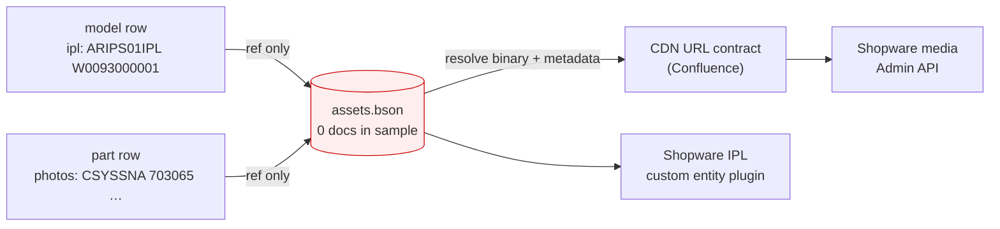
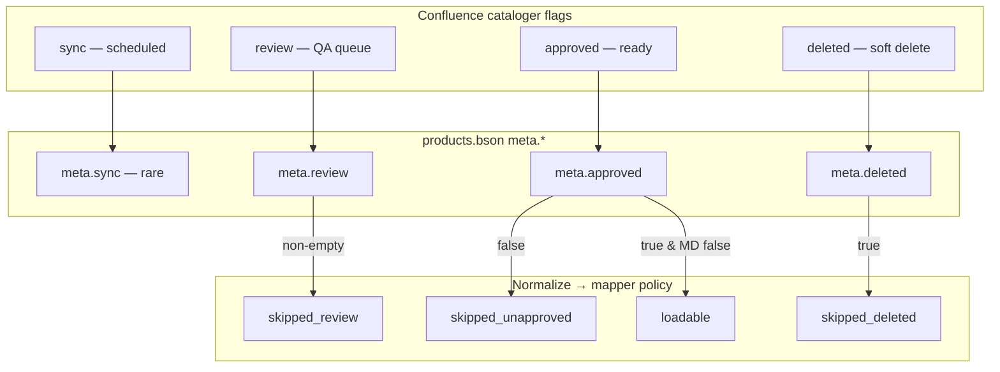
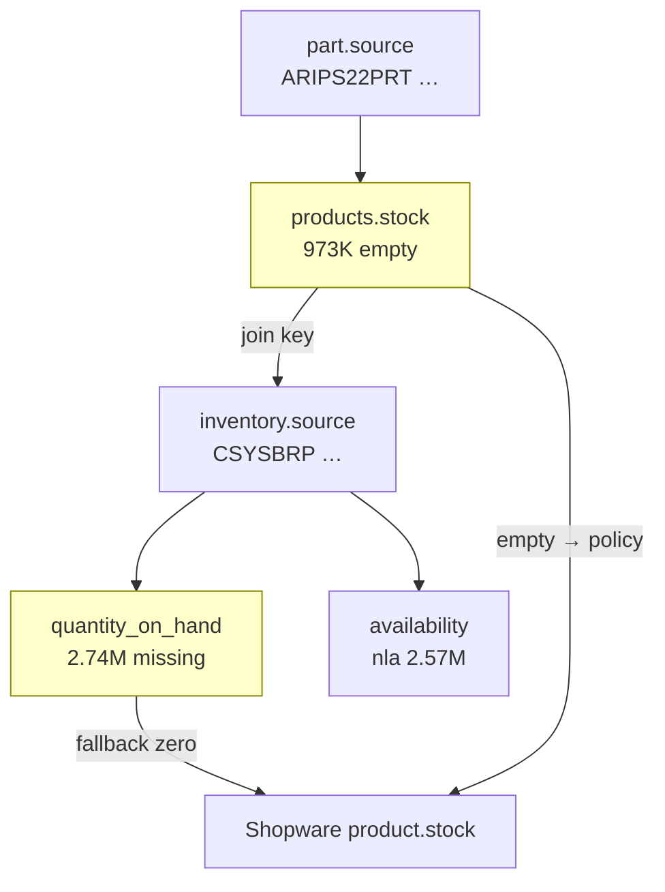
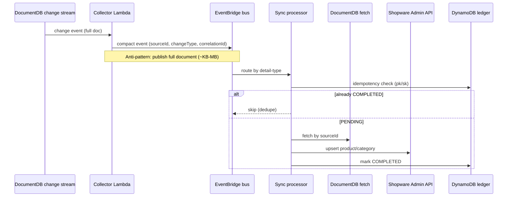

# 3. Schema Impedance

PartsTree’s Catalog DB was designed as a flexible document store: one polymorphic `products` collection, a separate `inventory` ledger, and (in production) an `assets` collection for diagrams and media. Shopware 6, by contrast, expects a **typed, relational catalog surface**—category trees for navigation, sellable `product` entities for parts, custom fields for scalar metadata, a **custom IPL entity** with M:N joins for exploded diagrams, and stock carried on products after cross-collection joins. The migration did not fail because transforms were impossible; it failed because **every meaningful edge in the target graph had to be invented** from sparse BSON, while several Confluence decisions remained open and the client sample omitted entire collections.

This section explains that impedance: why the Shopware target is structurally hard, what each assessment diagram (D1–D5) proves, how the mapping contract and JSON Schema pipeline encoded friction, and where Option 1/2 plus category capacity blocked ~37% of model rows before loaders could run.

---

## Why the Shopware target schema is hard

Shopware is not a mirror of DocumentDB. Store API and Admin API consumers assume:

1. **Stable entity types** — categories vs products vs plugin custom entities, each with distinct upsert shapes and indexing behavior.
2. **Topological load order** — manufacturers and categories before products; IPL joins after models and parts exist.
3. **Deterministic identity** — Sync API upserts require stable 32-char hex `id` values derived from natural keys (`products.source`, `inventory.source`); retries without them duplicate rows at multi-million scale.
4. **Publication semantics** — `active`, visibility, and stock must reflect cataloger workflow, not raw BSON presence.
5. **Operational envelopes** — bulk load uses `/api/_action/sync` with queue indexing; ongoing sync must respect EventBridge detail size limits, Lambda payload caps, and DocumentDB change-stream retention.

The assessment workspace materialized this gap as **machine-checkable contracts**: draft 2020-12 schemas under `discoveries/assessment/schemas/`, client-editable policy in `discoveries/assessment/config/target-mapping-policy.json`, row-level mapping rules in `discoveries/matrices/mapping-contract-starter.csv`, and `discoveries/assessment/scripts/validate_schema.mjs` (AJV) to validate normalized rows, Shopware write payloads, and compact sync events. Production recommendations in `discoveries/assessment/docs/deepwiki-target-ideal.md` reinforce a hybrid target: **categories for brand/model navigation**, **custom entity `ipl`** for diagrams, **custom fields** for scalar PT attributes and CDN URLs—not JSON blobs stuffed onto products at 355K+ IPL scale.

Measured sample scale (BSON profile, 2026-06-02): **5,142,183** `products` documents (**4,759,440** parts, **382,743** models), **3,626,867** inventory rows, **355,939** models with `ipl[]` references, and **no `assets.bson`** in the delivered archive. Dry-run transforms on 10k parts + 1k models showed **28.4%** rows not reaching Shopware payloads—dominated by undecided model mapping (923 blocked), missing media join (2,065 blocked), and publication/stock policy edges—not random bugs.

---

## D1 — Hierarchy collapse (current vs target entity model)

**Caption (source):** Source collapses Brand→Model→IPL→Parts into one `products` collection with a `type` discriminator. Target Shopware needs explicit category trees, ~1M IPL categories, and 3.5M part products — every edge must be synthesized in transform code.

```mermaid
flowchart TB
  subgraph Source["Catalog DB (BSON sample)"]
    P[("products.bson<br/>5.14M docs")]
    P -->|type=part| PT[4.76M parts]
    P -->|type=model| MD[383K models]
    MD -->|ipl[] string refs| IPLREF[355K models with IPL refs]
    INV[("inventory.bson<br/>3.63M docs")]
    PT -->|stock field| INV
    ASSETS[("assets.bson<br/>MISSING in sample")]
    IPLREF -.->|no join path| ASSETS
  end

  subgraph Target["Shopware 6 (Confluence MVP)"]
    B[Brand category]
    BF[Brand Family category]
    M[Model category]
    IPL[IPL category / custom entity]
    PR[Part product]
    B --> BF --> M --> IPL --> PR
    ST[Stock on product]
    PR --> ST
  end

  PT -->|normalize + map| PR
  MD -->|UNDECIDED: category vs custom entity| M
  IPLREF -->|blocked without assets| IPL
```

**Technical reading.** D1 is the root impedance diagram. Confluence and `partstree_catalog_shopware_overview.md` describe five navigation layers (Brand → Brand Family → Model → Model Variant → IPL → Parts). BSON delivers **two** `type` values inside `products` and infers brands from `marketing_brand[]` / `manufacturing_brand[]` arrays—no first-class `brands` or `models` collections (mapping contract row: “Model/category … hierarchy inference”). Brand Family is often **inferred**, not stored (CLI-004). That forces transforms to:

- De-duplicate brand strings into manufacturer/category scaffolding.
- Decide whether each of **382,743** model rows becomes a **Shopware category** (native SEO paths) or a **custom entity** (OD-01 / Confluence Option 1 vs 2)—while `target-mapping-policy.json` still had `modelTarget.decision: "undecided"`.
- Materialize IPL nodes from `ipl[]` string refs without `assets.bson` to resolve diagram metadata—blocking the entire IPL subgraph in D1’s dashed edge.

`normalized-model.schema.json` encodes this freeze: `shopware_target_decision` must be `category` or `custom_entity`; assessment runs emit `UNDECIDED_OD01` and `workflow_status: blocked_od01_mapping` until policy changes. Full-catalog projection: **141,758** models blocked in dry-run summaries pending OD-01—**~37%** of the model population never reached `shopware-category-write` validation.

Category **capacity** is not abstract. CLI-002 flags **382,743** BSON models against Confluence’s “~300K Models in Commerce” planning figure—before brand/family parents and before IPL nodes. If Confluence Option 1 places IPLs **under** models as categories, IPL cardinality adds roughly **one navigation node per diagram** across hundreds of thousands of models (diagram caption cites “~1M IPL categories” at target). Shopware can host large trees, but indexing, Sync API batch sizing, and Store API association depth must be smoke-tested per environment—artifacts that remained absent (G3 0/4) during assessment.

---

## D2 — IPL and media: broken join in the sample

**Caption:** 355K models carry `ipl[]` refs and parts carry `photos[]` asset IDs, but the sample archive has **no** `assets.bson`. IPL plugin + CDN contract cannot be validated from client data alone — diagram shows broken join.



**Technical reading.** D2 separates **reference** from **resolution**. Models store IPL identities as strings in `ipl[]`; parts store media identities in `photos[]`. Neither field embeds URLs, hotspot geometry, or MIME metadata required by Shopware’s `media` + `product_media` path or the **PartsTreeIplPlugin** custom entity. Resolution requires `assets.source` joins and a frozen **CDN base URL** (`mapping-contract-starter.csv` rows 9–11; policy `media.cdnBase: null`, `assets.collectionPresent: false`).

With `requireAssetsCollection: true`, the transform dry-run blocked **2,065 of 10,000** sampled parts (**20.65%**) on `blocked_no_media` even though **89.9%** of products have empty `photos[]`—the blocker hits the long tail with refs but no archive. IPL rows cannot be validated against `normalized-ipl.schema.json` at all without assets; deepwiki explicitly says **355K `ipl[]` without `assets.bson` is a loader block**, not justification to collapse IPL into custom fields only.

Target-state design (deepwiki hybrid) keeps IPL as **custom entity + `ipl_model` / `ipl_product` joins**, with CDN URLs on custom fields—not a parallel CDN-only catalog. D2’s red node is therefore a **schema gate**: G4 dry-run groups for media and IPL reported **loadable_count=0** until client delivery of `assets.bson` and CDN contract sign-off.

---

## D3 — Workflow flags: Confluence vs BSON encoding

**Caption:** Confluence describes four cataloger flags; BSON encodes three under `meta.*`. Deleted+approved rows (438,979 products) need explicit publication policy — default skip vs inactive load changes salable counts by ~8.5%.



**Technical reading.** D3 documents **semantic impedance**, not missing fields. Early ETL documentation referenced top-level `sync`; BSON stores workflow under **`meta.approved`**, **`meta.deleted`**, **`meta.review`** (`schemas/README.md`). Normalized schemas expose `workflow_status` enums; `validate_schema.mjs` validates those rows before Shopware mapping.

`target-mapping-policy.json` defaults (`publication.deletedPolicy: "skip"`, etc.) map meta flags to transform outcomes in D3’s bottom subgraph. **438,979** products have `meta.deleted=true`; **26,545** are unapproved. Switching `deletedPolicy` from `skip` to `load_inactive` changes Shopware salable population by roughly **8.5%**—a business decision, not a transform detail. Assessment sample run: **77** `skipped_deleted` in 11k rows with policy frozen to skip; zero `skipped_unapproved` in that slice—showing policy sensitivity at full scale.

Anti-pattern called out in deepwiki: loading deleted/unapproved without an explicit contract row (OD-06). Mapping contract row 10 notes models are “contested” for category mapping—workflow gates apply to both parts and models before hierarchy loaders run.

---

## D4 — Stock join: cross-collection impedance

**Caption:** `products.stock` → `inventory.source` is a cross-collection join. 973K parts have empty stock; 2.74M inventory rows lack `quantity_on_hand`. Shopware expects stock on the product — policy defaults mask data gaps.



**Technical reading.** Shopware stores sellable stock on the **product** entity (or Multi-Inventory API in advanced setups). BSON splits economic facts: `products.stock` is a string pointer; price, `quantity_on_hand`, and `availability` (`ava` / `nla` / `obs`) live on **`inventory`**. D4’s yellow nodes are measured gaps: **973,287** empty `products.stock` (mapping contract: route to DQ or fallback), **2,735,879** inventory rows missing `quantity_on_hand` (OD-05), **3,670** price parse failures (row 6).

`normalized-product.schema.json` (via README rules) classifies `stock_join_status` and `quantity_status` before `shopware-product-write.schema.json` emission. Policy `stock.emptyStockRefFallback: "zero"` and `missingQuantityFallback: "zero"`—defaults in assessment—**mask** gaps as salable zero stock rather than skipping (OD-04/05 unfrozen). Transform stats recorded **1,054** `stock_fallback_used` in the 11k sample—demonstrating policy-driven schema outcomes, not source truth. Wrong fallback choice at 4.4M loadable parts scale creates silent oversell or false NLA—reconciliation must compare ledger hashes to Shopware read-back, not trust loader logs.

---

## D5 — EventBridge scale: notification vs payload transport

**Caption:** At 5M+ documents, emitting full BSON on the bus fails size/cost limits. Compact events (sourceId only) match Confluence EventBridge design but force fetch-on-process + idempotent upsert + DynamoDB ledger.



**Technical reading.** D5 addresses **ongoing** schema impedance after baseline load. Large product documents—with `ipl[]`, `photos[]`, long descriptions—exceed practical EventBridge/Lambda limits if replicated on the bus. DocumentDB change streams cap event size (**16 MB**); Lambda payloads are **≤ 6 MB**; `fullDocument: updateLookup` on wide docs is an anti-pattern (deepwiki table). The approved contract is `compact-sync-event.schema.json`: **~12 properties**, no embedded documents—`sourceCollection`, `sourceId`, `correlationId`, `changeType`, optional `workflowHint` only.

`validate_schema.mjs --all-examples` validates those events alongside normalized and Shopware payloads—same normalization path as baseline, but processors **must fetch authoritative state** from DocumentDB. Ledger keys `SOURCE#{collection}#{sourceId}` + `EVENT#{correlationId}` provide at-least-once dedupe; Shopware upserts use deterministic UUIDs from `products.source`. EventBridge routes by `detail-type`; durable state lives in **DynamoDB + checkpoints**, not the bus—aligning D5 with D1–D4: compact notifications, fat documents resolved at process time with the same join and workflow rules as bulk load.

---

## Mapping friction: contract rows, Option 1/2, IPL, and model capacity

`mapping-contract-starter.csv` is the human-readable impedance register—each row ties a business field to source columns, join paths, validation, Shopware payload targets, and edge cases. High-friction rows include:

| Row | Friction |
|-----|----------|
| Brand / manufacturer | Array fields on products; de-dupe rules unfrozen (OD-10) |
| Stock / price / qty / availability | Cross-collection join + 973K empty stock + 2.74M missing qty + enum map (OD-04–08) |
| Product photos | `photos[]` → `assets` lookup; **blocked locally** without `assets.bson` |
| Model/category | `type=model`; **“Model as category is contested in plan”** |
| IPL | Assets/IPL many-to-many; custom plugin required; mock/invisible policy (OD-02) |

**Confluence Option 1 vs Option 2 (OD-01 / CLI-006)** is the decisive fork for **where model rows land** in Shopware:

- **Option 1 (`modelTarget.decision: "category"`)** — Treat models (and, per Confluence navigation design, potentially IPLs) as **category tree nodes** for Store API SEO and browsing. Matches `shopware-category-write.schema.json` and Phase 2 load order in deepwiki. Requires hierarchy inference from sparse `model_name`, `product_family`, and brand arrays; topological parent ordering; and proof that **382K+** model categories plus IPL children fit indexing and ops SLOs.
- **Option 2 (`modelTarget.decision: "custom_entity"`)** — Represent models as a **plugin custom entity** rather than native categories—shifting navigation semantics and join patterns. Still requires IPL custom entity and part products; changes reconciliation queries and storefront integration assumptions.

Assessment kept `undecided`, which `config/README.md` defines as **blocking all model transforms**—mirroring **92.3%** of non-deleted models in the 1k sample (923 `blocked_model_mapping`). This is separate from but related to **IPL** placement: deepwiki recommends **custom entity `ipl`** with M:N joins regardless—a hybrid, not “IPL as JSON on product.” Stuffing 355K IPL graphs into custom fields only was explicitly listed as an anti-pattern.

**IPL custom entity** friction stacks on D1–D2: even after OD-01 resolves, loaders need `assets.bson`, plugin smoke (G3), `normalized-ipl.schema.json` valid rows, and join tables `ipl_model` / `ipl_product`. Mapping contract row 11: “Blocked locally because full assets/IPL source is missing.”

**Category capacity for 382K models** is a planning and performance constraint, not just a mapping choice. CLI-002 marks high schema impact when BSON model count exceeds Confluence commerce estimates. Load manifests must batch category upserts (50–200 entities per Sync API call, tuned for 429 backoff) with `indexing-behavior: use-queue-indexing`. Undecided OD-01 blocked Phase 2 entirely in the assessment checklist—**~84%** of sample models in transform tests—while parts could partially normalize subject to publication, stock, and media policies.

---

## Schema validation as impedance instrumentation

`validate_schema.mjs` registers all `*.schema.json` under `discoveries/assessment/schemas/` and validates:

- `normalized-product` / `normalized-model` JSONL intermediates,
- `shopware-product-write` Admin payloads,
- `compact-sync-event` arrays for Batch F.

Failures are structural evidence of impedance: model rows fail while `UNDECIDED_OD01`; part rows fail media schema when `cdnBase` is null; events fail if payloads embed documents. The pipeline turned “Shopware is hard” into **countable blockers** tied to diagrams D1–D5 and CLI/issue matrix rows—so post-mortem readers can see schema difficulty as measured outcomes, not consultant opinion.

---

## Section summary

Schema impedance is the gap between a collapsed DocumentDB catalog and a layered Shopware commerce model. D1 shows synthesized hierarchy; D2 shows broken asset resolution; D3 shows workflow semantic drift; D4 shows split stock/price data; D5 shows why sync must be compact. Mapping contract rows and frozen JSON Schemas made that gap operable—but **Option 1/2**, IPL plugin dependencies, and **382K** model scale kept the target schema formally unproven until domain decisions and `assets.bson` arrived.
